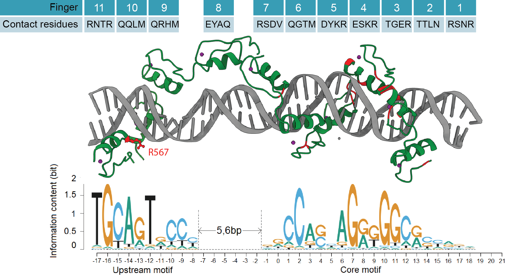
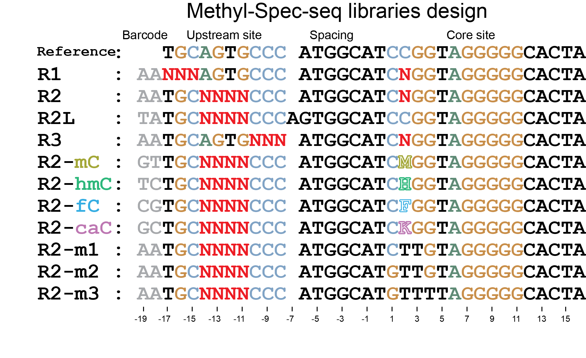

## Background and Experimental Design

CTCF, the well-established genome insulator in vertebrates, consists of 11 conserved C2H2- zinc fingers and is known to be sensitive to CpG methylation at specific position within the core motif. In 2013, it was reported that codon mutation R567W located at finger 11 can cause intellectural disabilities and autisms [(Gregor et. al)](https://pubmed.ncbi.nlm.nih.gov/23746550/), and the current mainstream thinking is the disease phenotype is driven by haploinsufficiency.

In recent years, more missense mutations have been identified [(Enrico et. al)](https://pubmed.ncbi.nlm.nih.gov/31239556/) and parts of the structures (F2 to F7, F6 to F11) in complex with DNA have been solved [(Hashimoto et. al)](https://pubmed.ncbi.nlm.nih.gov/28529057/) [(Yin et.al)](https://pubmed.ncbi.nlm.nih.gov/29076501/), so I created a chimera structural model based on two separate structures (pdb [#5T0U](https://www.rcsb.org/structure/5T0U) and [#5YEL](https://www.rcsb.org/structure/5YEL)) and mapped currently known disease variants onto the structure (colored <span style="color: red;">red</span>), which showed clear structure-function correlation, i.e., all identified disease variants are located at those base-touching fingers.



Also it is well established that CTCF is sensitive to CpG methylation [(Hark et. al)](https://pubmed.ncbi.nlm.nih.gov/10839547/), which is important to the regulation of some biological processes such as epigenetic silencing and imprinting control [(Schoenherr et. al)](https://www.nature.com/articles/ng1057z). However, there has been no systematic study of CTCF's response to other types of DNA modifications,  e.g., hydroxylmethylation (hmC), formylation (fC), and carboxylation (caC).


### Libraries design

To address above questions, I built three protein constructs, i.e., hisHALO-CTCF(F1-F9) as negative control, hisHALO-CTCF(F1-F11), and hisHALO-CTCF-R567W, and succesfully used NEB in-vitro expression system to make the proteins for DNA binding and EMSA separations. Also I designed following sequencing libraries to randomize different positions of upstream sequence (R1, R2, and R3) with position 2 in Core site randomized simutaneously. Some previous work showed CpG methylation effect at position 2 and 3 is primarily caused by cytosine methylation at position 2, so I introduced different types of modifications to the upper strand of DNA duplex at position 2 in R2 libraries (R2-mC, hmC, fC, and caC), wheares each type of modification is associated with some unique barcodes at position 18-19 for sequencing readout and identification.



## Importing and processing data
```{r message=FALSE, warning=FALSE, include=FALSE}
library(stringr)
library(dplyr)
library(tidyr)
library(readr)
library(ggplot2)
library(magrittr)
library(ggbeeswarm)
library(cowplot)
```

```{r Classification of sequence into library type, message=FALSE, warning=FALSE, include=FALSE}
require(stringr)
reference.CTCF = "AATGCAGTGCCCATGGCATCCGGTAGGGGGCACTA"

property_type <- function(seq) {
  if (str_detect(seq, "^AA") == TRUE) return("un")
  else if (str_detect(seq, "^AT") == TRUE) return("un")
  else if (str_detect(seq, "^GT") == TRUE) return("mC")
  else if (str_detect(seq, "^TC") == TRUE) return("hmC")
  else if (str_detect(seq, "^CG") == TRUE) return("fC")
  else if (str_detect(seq, "^GC") == TRUE) return("caC")
  else return("Unclassified")
}


library_type <- function(seq) {
  if(str_detect(seq, "^AT") == TRUE) return("R2L")
  else if(str_detect(seq, "^..TGC....CCCATGGCATC.GGTAGGGGGCACTA") == TRUE) return("R2")
  else if(str_detect(seq, "^..TGC....CCCATGGCATCTTGTAGGGGGCACTA") == TRUE) return("R2-m1")
  else if(str_detect(seq, "^..TGC....CCCATGGCATGTTGTAGGGGGCACTA") == TRUE) return("R2-m2")
  else if(str_detect(seq, "^..TGC....CCCATGGCATGTTTTAGGGGGCACTA") == TRUE) return("R2-m3")
  else if(str_detect(seq, "^.....AGTGCCCATGGCATC.GGTAGGGGGCACTA") == TRUE) return("R1")
  else if(str_detect(seq, "^..TGCAGTG...ATGGCATC.GGTAGGGGGCACTA") == TRUE) return("R3")
  else return("Unclassified")
}

#save.image("CTCF_122320.Rdata")
load("./CTCF_122320.Rdata")


CTCF.F1_F9.Sample1.processed %>%
  dplyr::filter(Library == "R2", Property == "caC", Bound + Unbound > 50)

CTCF.F1_F11.Sample1.processed %>%
  dplyr::filter(Library == "R2", Property == "un", Bound + Unbound > 50)
```

## Comparison of substitution effect depending on upstream site strength under different constructs

```{r fig.height=4.1, fig.width=9.5}
CTCF.F1_F9.Sample2.processed %>%
  filter(Library %in% c("R2","R2-m1","R2-m2","R2-m3")，Property == "un") %>%
  tidyr::spread(Core, Energy) %>%
  group_by(Upstream) %>%
  summarise(Energy.un = sum(CCGGTAGGGGGCA, na.rm = TRUE),
            C_T  = sum(CTGGTAGGGGGCA, na.rm = TRUE) - sum(CCGGTAGGGGGCA, na.rm = TRUE),
            C_A  = sum(CAGGTAGGGGGCA, na.rm = TRUE) - sum(CCGGTAGGGGGCA, na.rm = TRUE),
            C_G  = sum(CGGGTAGGGGGCA, na.rm = TRUE) - sum(CCGGTAGGGGGCA, na.rm = TRUE),
            C_m1 = sum(CTTGTAGGGGGCA, na.rm = TRUE) - sum(CCGGTAGGGGGCA, na.rm = TRUE),
            C_m2 = sum(GTTGTAGGGGGCA, na.rm = TRUE) - sum(CCGGTAGGGGGCA, na.rm = TRUE),
            C_m3 = sum(GTTTTAGGGGGCA, na.rm = TRUE) - sum(CCGGTAGGGGGCA, na.rm = TRUE),) %>%
  gather(`C_T`, `C_A`, `C_G`, `C_m1`, `C_m2`, `C_m3`, key = "Type", value = "Effect") -> CTCF.F1_F9.Sample2.merged1

CTCF.F1_F9.Sample2.processed %>%
  filter(Library == "R2"，Core == "CCGGTAGGGGGCA") %>%
  tidyr::spread(Property, Energy) %>%
  group_by(Upstream) %>%
  summarise(Energy.un = sum(un, na.rm = TRUE),
            mC = sum(mC, na.rm = TRUE)-sum(un, na.rm = TRUE),
            hmC= sum(hmC, na.rm = TRUE)-sum(un, na.rm = TRUE),
            fC = sum(fC, na.rm = TRUE)-sum(un, na.rm = TRUE),
            caC = sum(fC, na.rm = TRUE)-sum(un, na.rm = TRUE)) %>%
  gather(`mC`, `hmC`, `fC`, `caC`, key = "Type", value = "Effect") -> CTCF.F1_F9.Sample2.merged2

rbind(CTCF.F1_F9.Sample2.merged1, CTCF.F1_F9.Sample2.merged2) %>% mutate(Construct="F1-F9") -> CTCF.F1_F9.Sample2.merged


CTCF.F1_F11.Sample1.processed %>%
  filter(Library %in% c("R2","R2-m1","R2-m2","R2-m3")，Property == "un") %>%
  tidyr::spread(Core, Energy) %>%
  group_by(Upstream) %>%
  summarise(Energy.un = sum(CCGGTAGGGGGCA, na.rm = TRUE),
            C_T  = sum(CTGGTAGGGGGCA, na.rm = TRUE) - sum(CCGGTAGGGGGCA, na.rm = TRUE),
            C_A  = sum(CAGGTAGGGGGCA, na.rm = TRUE) - sum(CCGGTAGGGGGCA, na.rm = TRUE),
            C_G  = sum(CGGGTAGGGGGCA, na.rm = TRUE) - sum(CCGGTAGGGGGCA, na.rm = TRUE),
            C_m1 = sum(CTTGTAGGGGGCA, na.rm = TRUE) - sum(CCGGTAGGGGGCA, na.rm = TRUE),
            C_m2 = sum(GTTGTAGGGGGCA, na.rm = TRUE) - sum(CCGGTAGGGGGCA, na.rm = TRUE),
            C_m3 = sum(GTTTTAGGGGGCA, na.rm = TRUE) - sum(CCGGTAGGGGGCA, na.rm = TRUE),) %>%
  gather(`C_T`, `C_A`, `C_G`, `C_m1`, `C_m2`, `C_m3`, key = "Type", value = "Effect") -> CTCF.F1_F11.Sample1.merged1

CTCF.F1_F11.Sample1.processed %>%
  filter(Library == "R2"，Core == "CCGGTAGGGGGCA") %>%
  tidyr::spread(Property, Energy) %>%
  group_by(Upstream) %>%
  summarise(Energy.un = sum(un, na.rm = TRUE),
            mC = sum(mC, na.rm = TRUE)-sum(un, na.rm = TRUE),
            hmC= sum(hmC, na.rm = TRUE)-sum(un, na.rm = TRUE),
            fC = sum(fC, na.rm = TRUE)-sum(un, na.rm = TRUE),
            caC = sum(fC, na.rm = TRUE)-sum(un, na.rm = TRUE)) %>%
  gather(`mC`, `hmC`, `fC`, `caC`, key = "Type", value = "Effect") -> CTCF.F1_F11.Sample1.merged2

rbind(CTCF.F1_F11.Sample1.merged1, CTCF.F1_F11.Sample1.merged2) %>% mutate(Construct="F1-F11") -> CTCF.F1_F11.Sample1.merged


CTCF.R567W.Sample1.processed %>%
  filter(Library %in% c("R2","R2-m1","R2-m2","R2-m3")，Property == "un") %>%
  tidyr::spread(Core, Energy) %>%
  group_by(Upstream) %>%
  summarise(Energy.un = sum(CCGGTAGGGGGCA, na.rm = TRUE),
            C_T  = sum(CTGGTAGGGGGCA, na.rm = TRUE) - sum(CCGGTAGGGGGCA, na.rm = TRUE),
            C_A  = sum(CAGGTAGGGGGCA, na.rm = TRUE) - sum(CCGGTAGGGGGCA, na.rm = TRUE),
            C_G  = sum(CGGGTAGGGGGCA, na.rm = TRUE) - sum(CCGGTAGGGGGCA, na.rm = TRUE),
            C_m1 = sum(CTTGTAGGGGGCA, na.rm = TRUE) - sum(CCGGTAGGGGGCA, na.rm = TRUE),
            C_m2 = sum(GTTGTAGGGGGCA, na.rm = TRUE) - sum(CCGGTAGGGGGCA, na.rm = TRUE),
            C_m3 = sum(GTTTTAGGGGGCA, na.rm = TRUE) - sum(CCGGTAGGGGGCA, na.rm = TRUE),) %>%
  gather(`C_T`, `C_A`, `C_G`, `C_m1`, `C_m2`, `C_m3`, key = "Type", value = "Effect") -> CTCF.R567W.Sample1.merged1

CTCF.R567W.Sample1.processed %>%
  filter(Library == "R2"，Core == "CCGGTAGGGGGCA") %>%
  tidyr::spread(Property, Energy) %>%
  group_by(Upstream) %>%
  summarise(Energy.un = sum(un, na.rm = TRUE),
            mC = sum(mC, na.rm = TRUE)-sum(un, na.rm = TRUE),
            hmC= sum(hmC, na.rm = TRUE)-sum(un, na.rm = TRUE),
            fC = sum(fC, na.rm = TRUE)-sum(un, na.rm = TRUE),
            caC = sum(fC, na.rm = TRUE)-sum(un, na.rm = TRUE)) %>%
  gather(`mC`, `hmC`, `fC`, `caC`, key = "Type", value = "Effect") -> CTCF.R567W.Sample1.merged2

rbind(CTCF.R567W.Sample1.merged1, CTCF.R567W.Sample1.merged2) %>% mutate(Construct="R567W") -> CTCF.R567W.Sample1.merged


#ggsave("Comparison of modification effects between wildtype and R567W_2.svg", width = 9.5, height = 4.1)
```


```{r fig.height=5, fig.width=11}
rbind(CTCF.F1_F9.Sample2.merged, CTCF.F1_F11.Sample1.merged, CTCF.R567W.Sample1.merged) %>%
  mutate(Construct = factor(Construct, levels = c("F1-F9", "F1-F11", "R567W")),
         Type = case_when(Type == "mC"   ~ "C to mC",
                          Type == "hmC"  ~ "C to hmC",
                          Type == "fC"   ~ "C to fC",
                          Type == "caC"  ~ "C to caC",
                          Type == "C_G"  ~ "CCGGT to CGGGT",
                          Type == "C_T"  ~ "CCGGT to CTGGT",
                          Type == "C_A"  ~ "CCGGT to CAGGT",
                          Type == "C_m1" ~ "CCGGT to CTTGT",
                          Type == "C_m2" ~ "CCGGT to GTTGT",
                          Type == "C_m3" ~ "CCGGT to GTTTT",)) %>%
  mutate(Type = factor(Type, levels = c("C to mC", "C to hmC", "C to fC", "C to caC", 
                                        "CCGGT to CAGGT", "CCGGT to CGGGT", "CCGGT to CTGGT",
                                        "CCGGT to CTTGT", "CCGGT to GTTGT", "CCGGT to GTTTT"))) %>%
  ggplot() +
  geom_point(aes(x = -Energy.un,
             y = Effect, color = Type), size = 1) +
  #ggpubr::stat_regline_equation(label.y = 0, aes(label = ..rr.label..)) +
 # scale_size_binned(range = c(0.1, 1.5)) +
  xlim(-2, 1) + ylim(-0.3, 3.5) +
  xlab("Strength of Upstream site (kT)\n (-Energy of unmethylated site with reference Core CCGGT)") +
  ylab("Observed substitution effect (kT)") +
  #scale_color_manual(values=c("#A3A500", "#00BF7D", "#00B0F6", "#E76BF3", "#DA9030", "#000000", "#2E9682")) +
  guides(colour = FALSE) +
  theme(legend.position = "bottom") +
  facet_grid(Construct ~ Type)
```

```{r}
inner_join(CTCF.R567W.Sample1.merged, CTCF.F1_F11.Sample1.merged,
           by = c("Upstream", "Type"),
           suffix = c(".R567W", ".F1_F11")) %>%
  mutate(Type = case_when(Type == "mC"   ~ "C to mC",
                          Type == "hmC"  ~ "C to hmC",
                          Type == "fC"   ~ "C to fC",
                          Type == "caC"  ~ "C to caC",
                          Type == "C_G"  ~ "CCGGT to CGGGT",
                          Type == "C_T"  ~ "CCGGT to CTGGT",
                          Type == "C_A"  ~ "CCGGT to CAGGT",
                          Type == "C_m1" ~ "CCGGT to CTTGT",
                          Type == "C_m2" ~ "CCGGT to GTTGT",
                          Type == "C_m3" ~ "CCGGT to GTTTT",)) %>%
  mutate(Type = factor(Type, levels = c("C to mC", "C to hmC", "C to fC", "C to caC", 
                                        "CCGGT to CAGGT", "CCGGT to CGGGT", "CCGGT to CTGGT",
                                        "CCGGT to CTTGT", "CCGGT to GTTGT", "CCGGT to GTTTT"))) %>%
  ggplot(aes(x = Effect.F1_F11,
                 y = Effect.R567W, color = Type,
                 size = exp(-Energy.un.F1_F11))) +
  geom_point() +
  geom_abline(intercept = 0, slope = 1, linetype = "dashed") +
  scale_size_binned(range = c(0.1, 1.5)) +
  xlim(-0.3, 3) + ylim(-0.3, 3) +
  xlab("Observed effects in F1-F11 experiment (kT)") +
  ylab("Observed effects in R567W experiment (kT)") +
  #scale_color_manual(values=c("#A3A500", "#00BF7D", "#00B0F6", "#E76BF3", "#DA9030", "#000000", "#2E9682")) +
  guides(colour = FALSE) +
  theme(legend.position = "bottom") +
  facet_wrap(~Type, ncol = 4)
```


