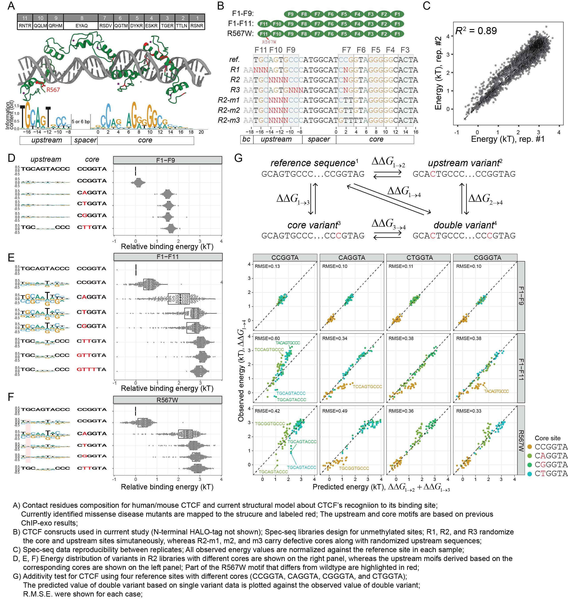

## Background



```{r Classification of sequence into library type, message=FALSE, warning=FALSE, include=FALSE}
require(stringr)
require(dplyr)
require(tidyr)
require(readr)
require(ggplot2)
require(magrittr)
require(cowplot)

#save.image("CTCF_122320.Rdata")
load("../data/CTCF_122320.Rdata")

reference.CTCF  = "AATGCAGTGCCCATGGCATCCGGTAGGGGGCACTA"
reference.CTGGT = "AATGCAGTGCCCATGGCATCTGGTAGGGGGCACTA"
reference.CAGGT = "AATGCAGTGCCCATGGCATCAGGTAGGGGGCACTA"
reference.CGGGT = "AATGCAGTGCCCATGGCATCGGGTAGGGGGCACTA"


property_type <- function(seq) {
  if (str_detect(seq, "^AA") == TRUE) return("un")
  else if (str_detect(seq, "^AT") == TRUE) return("un")
  else if (str_detect(seq, "^GT") == TRUE) return("mC")
  else if (str_detect(seq, "^TC") == TRUE) return("hmC")
  else if (str_detect(seq, "^CG") == TRUE) return("fC")
  else if (str_detect(seq, "^GC") == TRUE) return("caC")
  else return("Unclassified")
}


library_type <- function(seq) {
  if(     str_detect(seq, "^ATGC....CCCAGTGGCATCCGGTAGGGGGCACTA") == TRUE) return("R2L")
  else if(str_detect(seq, "^AATGC....CCCATGGCATC.GGTAGGGGGCACTA") == TRUE) return("R2")
  else if(str_detect(seq, "^GTTGC....CCCATGGCATC.GGTAGGGGGCACTA") == TRUE) return("R2")
  else if(str_detect(seq, "^TCTGC....CCCATGGCATC.GGTAGGGGGCACTA") == TRUE) return("R2")
  else if(str_detect(seq, "^CGTGC....CCCATGGCATC.GGTAGGGGGCACTA") == TRUE) return("R2")
  else if(str_detect(seq, "^GCTGC....CCCATGGCATC.GGTAGGGGGCACTA") == TRUE) return("R2")
  else if(str_detect(seq, "^AATGC....CCCATGGCATCTTGTAGGGGGCACTA") == TRUE) return("R2-m1")
  else if(str_detect(seq, "^AATGC....CCCATGGCATGTTGTAGGGGGCACTA") == TRUE) return("R2-m2")
  else if(str_detect(seq, "^AATGC....CCCATGGCATGTTTTAGGGGGCACTA") == TRUE) return("R2-m3")
  else if(str_detect(seq, "^AA...AGTGCCCATGGCATC.GGTAGGGGGCACTA") == TRUE) return("R1")
  else if(str_detect(seq, "^AATGCAGTG...ATGGCATC.GGTAGGGGGCACTA") == TRUE) return("R3")
  else return("Unclassified")
}


CTCF.F1_F9.Sample2.processed %<>%
  mutate(Library = purrr::map_chr(Sequence, library_type)) %>%
  dplyr::filter((Property != "Unclassified") & (Library != "Unclassified") & (!str_detect(Sequence, "N")))
  

CTCF.F1_F11.Sample1.processed %<>%
  mutate(Library = purrr::map_chr(Sequence, library_type)) %>%
  dplyr::filter((Property != "Unclassified") & (Library != "Unclassified") & (!str_detect(Sequence, "N")))

CTCF.R567W.Sample1.processed %<>%
  mutate(Library = purrr::map_chr(Sequence, library_type)) %>%
  dplyr::filter((Property != "Unclassified") & (Library != "Unclassified") & (!str_detect(Sequence, "N")))
```


## Comparison of observed energy values of double variants with predicted values by single variants data


```{r fig.height=7.6, fig.width=11, message=FALSE, warning=FALSE}
CTCF.F1_F9.Sample2.processed %>%
  mutate(Mismatch = TFCookbook::countMismatch(Sequence, reference.CTCF)) %>%
  filter(  (Property=="un" & Library%in%c("R1","R2","R3") & Mismatch <= 1) |
           (Property=="un" & Library %in% c("R2-m1", "R2-m2", "R2-m3") & Upstream=="TGCAGTACCC")) %>%
  TFCookbook::buildEnergyModel() -> Model.F1_F9.CCGGT

CTCF.F1_F9.Sample2.processed %>%
  mutate(Mismatch = TFCookbook::countMismatch(Sequence, reference.CTGGT)) %>%
  filter(  (Property=="un" & Library%in%c("R1","R2","R3") & Mismatch <= 1) |
           (Property=="un" & Library %in% c("R2-m1", "R2-m2", "R2-m3") & Upstream=="TGCAGTACCC")) %>%
  TFCookbook::buildEnergyModel() -> Model.F1_F9.CTGGT

CTCF.F1_F9.Sample2.processed %>%
  mutate(Mismatch = TFCookbook::countMismatch(Sequence, reference.CAGGT)) %>%
  filter(  (Property=="un" & Library%in%c("R1","R2","R3") & Mismatch <= 1) |
           (Property=="un" & Library %in% c("R2-m1", "R2-m2", "R2-m3") & Upstream=="TGCAGTACCC")) %>%
  TFCookbook::buildEnergyModel() -> Model.F1_F9.CAGGT

CTCF.F1_F9.Sample2.processed %>%
  mutate(Mismatch = TFCookbook::countMismatch(Sequence, reference.CGGGT)) %>%
  filter(  (Property=="un" & Library%in%c("R1","R2","R3") & Mismatch <= 1) |
           (Property=="un" & Library %in% c("R2-m1", "R2-m2", "R2-m3") & Upstream=="TGCAGTACCC")) %>%
  TFCookbook::buildEnergyModel() -> Model.F1_F9.CGGGT

CTCF.F1_F9.Sample2.processed %>%
  filter(Property == "un", Library != "R2L") %>%
  mutate(Construct = "F1-F9",
         Predicted.Energy.CCGGT = TFCookbook::predictEnergy(Sequence, Model.F1_F9.CCGGT),
         Predicted.Energy.CTGGT = TFCookbook::predictEnergy(Sequence, Model.F1_F9.CTGGT),
         Predicted.Energy.CAGGT = TFCookbook::predictEnergy(Sequence, Model.F1_F9.CAGGT),
         Predicted.Energy.CGGGT = TFCookbook::predictEnergy(Sequence, Model.F1_F9.CGGGT),
         ) -> Predicted_vs_Observed.F1_F9


CTCF.F1_F11.Sample1.processed %>%
  mutate(Mismatch = TFCookbook::countMismatch(Sequence, reference.CTCF)) %>%
  filter(  (Property=="un" & Library%in%c("R1","R2","R3") & Mismatch <= 1) |
           (Property=="un" & Library %in% c("R2-m1", "R2-m2", "R2-m3") & Upstream=="TGCAGTACCC")) %>%
  TFCookbook::buildEnergyModel() -> Model.F1_F11.CCGGT

CTCF.F1_F11.Sample1.processed %>%
  mutate(Mismatch = TFCookbook::countMismatch(Sequence, reference.CTGGT)) %>%
  filter(  (Property=="un" & Library%in%c("R1","R2","R3") & Mismatch <= 1) |
           (Property=="un" & Library %in% c("R2-m1", "R2-m2", "R2-m3") & Upstream=="TGCAGTACCC")) %>%
  TFCookbook::buildEnergyModel() -> Model.F1_F11.CTGGT

CTCF.F1_F11.Sample1.processed %>%
  mutate(Mismatch = TFCookbook::countMismatch(Sequence, reference.CAGGT)) %>%
  filter(  (Property=="un" & Library%in%c("R1","R2","R3") & Mismatch <= 1) |
           (Property=="un" & Library %in% c("R2-m1", "R2-m2", "R2-m3") & Upstream=="TGCAGTACCC")) %>%
  TFCookbook::buildEnergyModel() -> Model.F1_F11.CAGGT

CTCF.F1_F11.Sample1.processed %>%
  mutate(Mismatch = TFCookbook::countMismatch(Sequence, reference.CGGGT)) %>%
  filter(  (Property=="un" & Library%in%c("R1","R2","R3") & Mismatch <= 1) |
           (Property=="un" & Library %in% c("R2-m1", "R2-m2", "R2-m3") & Upstream=="TGCAGTACCC")) %>%
  TFCookbook::buildEnergyModel() -> Model.F1_F11.CGGGT

CTCF.F1_F11.Sample1.processed %>%
  filter(Property == "un", Library != "R2L") %>%
  mutate(Construct = "F1-F11",
         Predicted.Energy.CCGGT = TFCookbook::predictEnergy(Sequence, Model.F1_F11.CCGGT),
         Predicted.Energy.CTGGT = TFCookbook::predictEnergy(Sequence, Model.F1_F11.CTGGT),
         Predicted.Energy.CAGGT = TFCookbook::predictEnergy(Sequence, Model.F1_F11.CAGGT),
         Predicted.Energy.CGGGT = TFCookbook::predictEnergy(Sequence, Model.F1_F11.CGGGT),
         ) -> Predicted_vs_Observed.F1_F11


CTCF.R567W.Sample1.processed %>%
  mutate(Mismatch = TFCookbook::countMismatch(Sequence, reference.CTCF)) %>%
  filter(  (Property=="un" & Library%in%c("R1","R2","R3") & Mismatch <= 1) |
           (Property=="un" & Library %in% c("R2-m1", "R2-m2", "R2-m3") & Upstream=="TGCAGTACCC")) %>%
  TFCookbook::buildEnergyModel() -> Model.R567W.CCGGT

CTCF.R567W.Sample1.processed %>%
  mutate(Mismatch = TFCookbook::countMismatch(Sequence, reference.CTGGT)) %>%
  filter(  (Property=="un" & Library%in%c("R1","R2","R3") & Mismatch <= 1) |
           (Property=="un" & Library %in% c("R2-m1", "R2-m2", "R2-m3") & Upstream=="TGCAGTACCC")) %>%
  TFCookbook::buildEnergyModel() -> Model.R567W.CTGGT

CTCF.R567W.Sample1.processed %>%
  mutate(Mismatch = TFCookbook::countMismatch(Sequence, reference.CAGGT)) %>%
  filter(  (Property=="un" & Library%in%c("R1","R2","R3") & Mismatch <= 1) |
           (Property=="un" & Library %in% c("R2-m1", "R2-m2", "R2-m3") & Upstream=="TGCAGTACCC")) %>%
  TFCookbook::buildEnergyModel() -> Model.R567W.CAGGT

CTCF.R567W.Sample1.processed %>%
  mutate(Mismatch = TFCookbook::countMismatch(Sequence, reference.CGGGT)) %>%
  filter(  (Property=="un" & Library%in%c("R1","R2","R3") & Mismatch <= 1) |
           (Property=="un" & Library %in% c("R2-m1", "R2-m2", "R2-m3") & Upstream=="TGCAGTACCC")) %>%
  TFCookbook::buildEnergyModel() -> Model.R567W.CGGGT

CTCF.R567W.Sample1.processed %>%
  filter(Property == "un", Library != "R2L") %>%
  mutate(Construct = "R567W",
         Predicted.Energy.CCGGT = TFCookbook::predictEnergy(Sequence, Model.R567W.CCGGT),
         Predicted.Energy.CTGGT = TFCookbook::predictEnergy(Sequence, Model.R567W.CTGGT),
         Predicted.Energy.CAGGT = TFCookbook::predictEnergy(Sequence, Model.R567W.CAGGT),
         Predicted.Energy.CGGGT = TFCookbook::predictEnergy(Sequence, Model.R567W.CGGGT),
         ) -> Predicted_vs_Observed.R567W


rbind(Predicted_vs_Observed.F1_F9,
      Predicted_vs_Observed.R567W,
      Predicted_vs_Observed.F1_F11) %>%
  gather(`Predicted.Energy.CCGGT`,`Predicted.Energy.CTGGT`,`Predicted.Energy.CAGGT`,`Predicted.Energy.CGGGT`,
         key = "Reference", value = "Predicted.Energy") %>%
  mutate(Construct = factor(Construct, levels = c("F1-F9", "R567W", "F1-F11")),
         Reference.Core = factor(case_when(Reference == "Predicted.Energy.CCGGT"  ~ "CCGGTAGGGGGCA",
                               Reference == "Predicted.Energy.CAGGT" ~ "CAGGTAGGGGGCA",
                               Reference == "Predicted.Energy.CTGGT" ~ "CTGGTAGGGGGCA",
                               Reference == "Predicted.Energy.CGGGT" ~ "CGGGTAGGGGGCA"),
                               levels = c("CCGGTAGGGGGCA", "CAGGTAGGGGGCA", "CTGGTAGGGGGCA", "CGGGTAGGGGGCA")),
         Core = factor(Core,
                       levels = c("CCGGTAGGGGGCA", "CAGGTAGGGGGCA", "CGGGTAGGGGGCA",
                                  "CTGGTAGGGGGCA","CTTGTAGGGGGCA", "GTTGTAGGGGGCA", "GTTTTAGGGGGCA"))) %>%
  mutate(Mismatch.Upstream = TFCookbook::countMismatch(as.character(Upstream), 'TGCAGTGCCC')) %>%
  dplyr::filter(Mismatch.Upstream == 1，Core != as.character(Reference.Core)) %>%
  dplyr::filter(Core %in% c("CCGGTAGGGGGCA", "CAGGTAGGGGGCA", "CGGGTAGGGGGCA", "CTGGTAGGGGGCA")) %>%
  mutate(Label = if_else(abs(Predicted.Energy-Energy) > 1.05, as.character(Upstream), "")) %>%
  ggplot(aes(x = Predicted.Energy, y = Energy)) +
  geom_point(aes(color = Core), size = 1.25) + geom_abline(slope = 1, intercept = 0, linetype = "dashed") +
 # ggpubr::stat_regline_equation(label.y = 3.85, aes(label = ..rmse..)) +
  ggrepel::geom_text_repel(aes(label = Label, color = Core),
                           show.legend = FALSE, force = 100) +
  xlab("Energy of double variants predicted by single variants data of chosen reference site (kT)")  + xlim(-0.5, 4) +
  ylab("Observed Energy of double variants (kT)") + ylim(-0.5, 4) + 
  scale_color_manual(values=c("#CD9600", "#7CAE00", "#00BE67", "#00BFC4", "#00A9FF", "#C77CFF", "#FF61CC")) +
  theme_bw() + theme(panel.grid.minor = element_blank()) +
  facet_grid(Construct ~ Reference.Core)


#ggsave("Predicted vs. Observed(all constructs).eps", width = 11, height = 7.6 )
```


## Calculating average deviations (R.M.S.E.) between observed and predicted energy values under each model
```{r message=FALSE, warning=FALSE}
rbind(Predicted_vs_Observed.F1_F9,
      Predicted_vs_Observed.R567W,
      Predicted_vs_Observed.F1_F11) %>%
  gather(`Predicted.Energy.CCGGT`,`Predicted.Energy.CTGGT`,`Predicted.Energy.CAGGT`,`Predicted.Energy.CGGGT`,
         key = "Reference", value = "Predicted.Energy") %>%
  mutate(Construct = factor(Construct, levels = c("F1-F9", "R567W", "F1-F11")),
         Reference.Core = factor(case_when(Reference == "Predicted.Energy.CCGGT"  ~ "CCGGTAGGGGGCA",
                               Reference == "Predicted.Energy.CAGGT" ~ "CAGGTAGGGGGCA",
                               Reference == "Predicted.Energy.CTGGT" ~ "CTGGTAGGGGGCA",
                               Reference == "Predicted.Energy.CGGGT" ~ "CGGGTAGGGGGCA"),
                               levels = c("CCGGTAGGGGGCA", "CAGGTAGGGGGCA", "CTGGTAGGGGGCA", "CGGGTAGGGGGCA")),
         Core = factor(Core,
                       levels = c("CCGGTAGGGGGCA", "CAGGTAGGGGGCA", "CGGGTAGGGGGCA",
                                  "CTGGTAGGGGGCA","CTTGTAGGGGGCA", "GTTGTAGGGGGCA", "GTTTTAGGGGGCA"))) %>%
  mutate(Mismatch.Upstream = TFCookbook::countMismatch(as.character(Upstream), 'TGCAGTGCCC')) %>%
  dplyr::filter(Mismatch.Upstream == 1，Core != as.character(Reference.Core)) %>%
  dplyr::filter(Core %in% c("CCGGTAGGGGGCA", "CAGGTAGGGGGCA", "CGGGTAGGGGGCA", "CTGGTAGGGGGCA")) %>%
  group_by(Construct, Reference.Core) %>%
  summarise(Construct, Reference.Core,
            RMSE = DescTools::RMSE(Predicted.Energy, Energy)) %>%
  unique()
```


