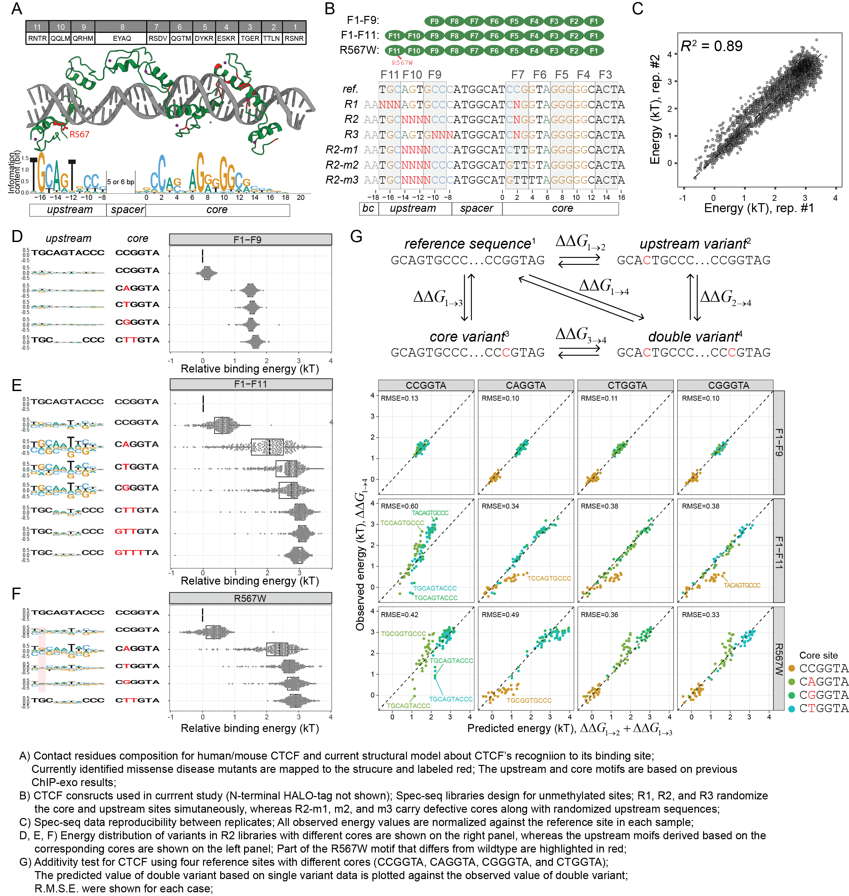

## Figure 3 in the paper


```{r Classification of sequence into library type, message=FALSE, warning=FALSE, include=FALSE}
require(stringr)
require(dplyr)
require(tidyr)
require(readr)
require(ggplot2)
require(magrittr)
require(ggbeeswarm)
require(cowplot)
reference.CTCF = "AATGCAGTGCCCATGGCATCCGGTAGGGGGCACTA"

#save.image("CTCF_122320.Rdata")
load("../data/CTCF_122320.Rdata")

property_type <- function(seq) {
  if (str_detect(seq, "^AA") == TRUE) return("un")
  else if (str_detect(seq, "^AT") == TRUE) return("un")
  else if (str_detect(seq, "^GT") == TRUE) return("mC")
  else if (str_detect(seq, "^TC") == TRUE) return("hmC")
  else if (str_detect(seq, "^CG") == TRUE) return("fC")
  else if (str_detect(seq, "^GC") == TRUE) return("caC")
  else return("Unclassified")
}


library_type <- function(seq) {
  if(     str_detect(seq, "^ATGC....CCCAGTGGCATCCGGTAGGGGGCACTA") == TRUE) return("R2L")
  else if(str_detect(seq, "^AATGC....CCCATGGCATC.GGTAGGGGGCACTA") == TRUE) return("R2")
  else if(str_detect(seq, "^GTTGC....CCCATGGCATC.GGTAGGGGGCACTA") == TRUE) return("R2")
  else if(str_detect(seq, "^TCTGC....CCCATGGCATC.GGTAGGGGGCACTA") == TRUE) return("R2")
  else if(str_detect(seq, "^CGTGC....CCCATGGCATC.GGTAGGGGGCACTA") == TRUE) return("R2")
  else if(str_detect(seq, "^GCTGC....CCCATGGCATC.GGTAGGGGGCACTA") == TRUE) return("R2")
  else if(str_detect(seq, "^AATGC....CCCATGGCATCTTGTAGGGGGCACTA") == TRUE) return("R2-m1")
  else if(str_detect(seq, "^AATGC....CCCATGGCATGTTGTAGGGGGCACTA") == TRUE) return("R2-m2")
  else if(str_detect(seq, "^AATGC....CCCATGGCATGTTTTAGGGGGCACTA") == TRUE) return("R2-m3")
  else if(str_detect(seq, "^AA...AGTGCCCATGGCATC.GGTAGGGGGCACTA") == TRUE) return("R1")
  else if(str_detect(seq, "^AATGCAGTG...ATGGCATC.GGTAGGGGGCACTA") == TRUE) return("R3")
  else return("Unclassified")
}


CTCF.F1_F9.Sample1.processed %<>%
  mutate(Library = purrr::map_chr(Sequence, library_type)) %>%
  dplyr::filter((Property != "Unclassified") & (Library != "Unclassified") & (!str_detect(Sequence, "N")))

CTCF.F1_F9.Sample2.processed %<>%
  mutate(Library = purrr::map_chr(Sequence, library_type)) %>%
  dplyr::filter((Property != "Unclassified") & (Library != "Unclassified") & (!str_detect(Sequence, "N")))
 # dplyr::filter(Library == "R2", Property == "caC", Bound + Unbound > 50)

CTCF.F1_F11.Sample1.processed %<>%
  mutate(Library = purrr::map_chr(Sequence, library_type)) %>%
  dplyr::filter((Property != "Unclassified") & (Library != "Unclassified") & (!str_detect(Sequence, "N")))

CTCF.F1_F11.Sample2.processed %<>%
  mutate(Library = purrr::map_chr(Sequence, library_type)) %>%
  dplyr::filter((Property != "Unclassified") & (Library != "Unclassified") & (!str_detect(Sequence, "N")))

CTCF.R567W.Sample1.processed %<>%
  mutate(Library = purrr::map_chr(Sequence, library_type)) %>%
  dplyr::filter((Property != "Unclassified") & (Library != "Unclassified") & (!str_detect(Sequence, "N")))

CTCF.R567W.Sample2.processed %<>%
  mutate(Library = purrr::map_chr(Sequence, library_type)) %>%
  dplyr::filter((Property != "Unclassified") & (Library != "Unclassified") & (!str_detect(Sequence, "N")))
```


## Dependence of Upstream specificity of wildtype CTCF on its Core site strength
```{r fig.height=5.5, fig.width=9.5, message=FALSE, warning=FALSE}
CTCF.F1_F11.Sample1.processed %>%
  filter(Library %in% c("R1", "R2", "R3")，Core == "CCGGTAGGGGGCA", Property == "un") %>%
  TFCookbook::buildEnergyModel() %>%
  TFCookbook::getEnergyMatrix() %>%
  TFCookbook::addAnchorMatrix(anchor = "TGCAGTACCC", position = 3, height = 0.5) %>%
  TFCookbook::addAnchorMatrix(anchor = "CCGGTAGGGGGCA", position = 16, height = 0.5) %>%
  TFCookbook::plotEnergyLogo() +
  xlim(2.5,21.5) + scale_y_continuous(breaks = c(-0.5, 0, 0.5), limits = c(-0.5, 0.5)) +
  theme(axis.text.x=element_blank(), plot.title = element_blank(),
        axis.title.x = element_blank(), axis.title.y = element_blank()) -> logo.F1_F11.Reference

CTCF.F1_F11.Sample1.processed %>%
  filter(Library %in% c("R1", "R2", "R3")，Core == "CCGGTAGGGGGCA", Property == "un") %>%
  TFCookbook::buildEnergyModel() %>%
  TFCookbook::getEnergyMatrix() %>%
  TFCookbook::addAnchorMatrix(anchor = "CCGGTAGGGGGCA", position = 16, height = 0.5) %>%
  TFCookbook::plotEnergyLogo() +
  xlim(2.5,21.5) + scale_y_continuous(breaks = c(-0.5, 0, 0.5), limits = c(-0.5, 0.5)) +
  theme(axis.text.x=element_blank(), plot.title = element_blank(),
        axis.title.x = element_blank(), axis.title.y = element_blank()) -> logo.F1_F11.CCGGT

CTCF.F1_F11.Sample1.processed %>%
  filter(Library %in% c("R1", "R2", "R3")，Core == "CTGGTAGGGGGCA", Property == "un") %>%
  TFCookbook::buildEnergyModel() %>%
  TFCookbook::getEnergyMatrix() %>%
  TFCookbook::addAnchorMatrix(anchor = "CTGGTAGGGGGCA", position = 16, height = 0.5) %>%
  TFCookbook::plotEnergyLogo() +
  xlim(2.5,21.5) + scale_y_continuous(breaks = c(-0.5, 0, 0.5), limits = c(-1, 1)) +
  theme(axis.text.x=element_blank(), plot.title = element_text(hjust = 0.08),
        axis.title.x = element_blank(), axis.title.y = element_blank()) -> logo.F1_F11.CTGGT

CTCF.F1_F11.Sample1.processed %>%
  filter(Library %in% c("R1", "R2", "R3")，Core == "CAGGTAGGGGGCA", Property == "un") %>%
  TFCookbook::buildEnergyModel() %>%
  TFCookbook::getEnergyMatrix() %>%
  TFCookbook::addAnchorMatrix(anchor = "CAGGTAGGGGGCA", position = 16, height = 0.5) %>%
  TFCookbook::plotEnergyLogo() +
  xlim(2.5,21.5) + scale_y_continuous(breaks = c(-0.5, 0, 0.5), limits = c(-1, 1)) +
  theme(axis.text.x=element_blank(), plot.title = element_text(hjust = 0.08),
        axis.title.x = element_blank(), axis.title.y = element_blank()) -> logo.F1_F11.CAGGT

CTCF.F1_F11.Sample1.processed %>%
  filter(Library %in% c("R1", "R2", "R3")，Core == "CGGGTAGGGGGCA", Property == "un") %>%
  TFCookbook::buildEnergyModel() %>%
  TFCookbook::getEnergyMatrix() %>%
  TFCookbook::addAnchorMatrix(anchor = "CGGGTAGGGGGCA", position = 16, height = 0.5) %>%
  TFCookbook::plotEnergyLogo() +
  xlim(2.5,21.5) + scale_y_continuous(breaks = c(-0.5, 0, 0.5), limits = c(-1, 1)) +
  theme(axis.text.x=element_blank(), plot.title = element_text(hjust = 0.08),
        axis.title.x = element_blank(), axis.title.y = element_blank()) -> logo.F1_F11.CGGGT

CTCF.F1_F11.Sample1.processed %>%
  filter(Library %in% c("R2L"),  Property == "un") %>%
  filter(Core == "CCGGTAGGGGGCA")%>%
  TFCookbook::buildEnergyModel() %>%
  TFCookbook::getEnergyMatrix() %>%
  TFCookbook::addAnchorMatrix(anchor = "TGC", position = 2, height = 0.5) %>%
  TFCookbook::addAnchorMatrix(anchor = "CCC", position = 9, height = 0.5) %>%
  TFCookbook::addAnchorMatrix(anchor = "CCGGTAGGGGGCA", position = 16, height = 0.5) %>%
  TFCookbook::plotEnergyLogo() +
  xlim(2.5,21.5) + ylim(-0.6, 0.6) + scale_y_continuous(breaks = c(-0.5, 0, 0.5)) +
  theme(axis.text.x=element_blank(), plot.title = element_text(hjust = 0.08),
        axis.title.x = element_blank(), axis.title.y = element_blank()) +
  annotate('segment', x = 14, xend=12.5, y=0.2, yend=0.2, size=1, arrow = arrow(length = unit(2, "mm"))) +
  annotate('segment', x = 12.5, xend=15, y=0.2, yend=0.2, size=1, arrow = arrow(length = unit(2, "mm"))) +
  annotate('text', x = 13.8, y=-0.1, label = '8bp spacing')-> logo.F1_F11.CCGGT.Long


CTCF.F1_F11.Sample1.processed %>%
  filter(Library %in% c("R2-m1")) %>%
  filter(Core == "CTTGTAGGGGGCA", Property == "un") %>%
  TFCookbook::buildEnergyModel() %>%
  TFCookbook::getEnergyMatrix() %>%
  TFCookbook::addAnchorMatrix(anchor = "TGC", position = 3, height = 0.5) %>%
  TFCookbook::addAnchorMatrix(anchor = "CCC", position = 10, height = 0.5) %>%
  TFCookbook::addAnchorMatrix(anchor = "CTTGTAGGGGGCA", position = 16, height = 0.5) %>%
  TFCookbook::plotEnergyLogo() +
#  ggtitle("Upstream motif of CTCF(F1-F11)") +
  xlim(2.5,21.5) + scale_y_continuous(breaks = c(-0.5, 0, 0.5), limits = c(-0.5, 0.5)) +
  theme(axis.text.x=element_blank(), plot.title = element_blank(),
        axis.title.x = element_blank(), axis.title.y = element_blank()) -> logo.F1_F11.CTTGT

CTCF.F1_F11.Sample1.processed %>%
  filter(Library %in% c("R2-m2")) %>%
  filter(Core == "GTTGTAGGGGGCA", Property == "un") %>%
  TFCookbook::buildEnergyModel() %>%
  TFCookbook::getEnergyMatrix() %>%
  TFCookbook::addAnchorMatrix(anchor = "TGC", position = 3, height = 0.5) %>%
  TFCookbook::addAnchorMatrix(anchor = "CCC", position = 10, height = 0.5) %>%
  TFCookbook::addAnchorMatrix(anchor = "GTTGTAGGGGGCA", position = 16, height = 0.5) %>%
  TFCookbook::plotEnergyLogo() +
#  ggtitle("Upstream motif of CTCF(F1-F11)") +
  xlim(2.5,21.5) + scale_y_continuous(breaks = c(-0.5, 0, 0.5), limits = c(-0.5, 0.5)) +
  theme(axis.text.x=element_blank(), plot.title = element_blank(),
        axis.title.x = element_blank(), axis.title.y = element_blank()) -> logo.F1_F11.GTTGT


CTCF.F1_F11.Sample1.processed %>%
  filter(Library %in% c("R2-m3")) %>%
  filter(Core == "GTTTTAGGGGGCA", Property == "un") %>%
  TFCookbook::buildEnergyModel() %>%
  TFCookbook::getEnergyMatrix() %>%
  TFCookbook::addAnchorMatrix(anchor = "TGC", position = 3, height = 0.5) %>%
  TFCookbook::addAnchorMatrix(anchor = "CCC", position = 10, height = 0.5) %>%
  TFCookbook::addAnchorMatrix(anchor = "GTTTTAGGGGGCA", position = 16, height = 0.5) %>%
  TFCookbook::plotEnergyLogo() +
#  ggtitle("Upstream motif of CTCF(F1-F11)") +
  xlim(2.5,21.5) + scale_y_continuous(breaks = c(-0.5, 0, 0.5), limits = c(-0.5, 0.5)) +
  theme(axis.text.x = element_blank(),
        axis.title.x = element_blank(), axis.title.y = element_blank()) -> logo.F1_F11.GTTTT

CTCF.R567W.Sample1.processed %>%
  filter(Library %in% c("R1", "R2", "R3"), Core == "CCGGTAGGGGGCA", Property == "un") %>%
  TFCookbook::buildEnergyModel() %>%
  TFCookbook::getEnergyMatrix() %>%
  TFCookbook::addAnchorMatrix(anchor = "CCGGTAGGGGGCA", position = 16, height = 0.5) %>%
  TFCookbook::plotEnergyLogo() + ylim(-0.6, 0.6) +
#  ggtitle("Upstream motif of CTCF-R567W") +
  xlim(2.5,21.5) +
  theme(axis.text.x=element_blank(), plot.title = element_blank(),
        axis.title.x = element_blank()) -> logo.R567W


cowplot::plot_grid(logo.F1_F11.Reference,
                   logo.F1_F11.CCGGT,
       #            logo.F1_F11.CCGGT.Long,
                   logo.F1_F11.CAGGT,
                   logo.F1_F11.CTGGT,
                   logo.F1_F11.CGGGT,
                   logo.F1_F11.CTTGT,
                   logo.F1_F11.GTTGT,
                   logo.F1_F11.GTTTT,
          rel_heights = c(1, 1, 1.75, 1.75, 1.75, 1, 1),
          ncol = 1, align = "v") -> plot.logos


CTCF.F1_F11.Sample1.processed %>%
  filter(Library %in% c("R2", "R2-m1", "R2-m2", "R2-m3"),
         Property == "un") %>%
  mutate(Core = case_when(Library  == "R2L" ~"CLGGTAGGGGGCA",
                          Sequence == reference.CTCF ~ "Reference",
                          TRUE ~ Core)) %>%
  mutate(Core = factor(Core, levels = c("Reference",
                                        "CCGGTAGGGGGCA", "CLGGTAGGGGGCA", "CAGGTAGGGGGCA", "CTGGTAGGGGGCA", "CGGGTAGGGGGCA",
                                        "CTTGTAGGGGGCA", "GTTGTAGGGGGCA", "GTTTTAGGGGGCA"))) %>%
  ggplot(aes(x = Energy, y = Core, color = Core), show.legend = FALSE) +
  geom_boxplot(notch = FALSE, outlier.shape = NA, color = "black") +
  geom_quasirandom(size = 1, alpha = 0.8, groupOnX = FALSE, color = "black") + scale_y_discrete(limits = rev) +
  xlab("Relative binding energy (kT)") + theme_bw() +
  theme(legend.position = "none", axis.text.y = element_blank(), axis.title.y = element_blank()) +
  labs(shape="Core Sequence", color = "Core Sequence")  + xlim(-0.8, 3.8) -> plot.distribution


cowplot::plot_grid(plot.logos,
                   plot.distribution,
          ncol = 2, align = "h", axis = "tb")

#ggsave(filename = "Logos_F1_F11.svg", plot = last_plot(), width = 9.5, height = 5.5)
```


## Dependence of Upstream specificity of mutant CTCF-R567W on its Core site strength
```{r fig.height=3.5, fig.width=9.5, message=FALSE, warning=FALSE}
CTCF.R567W.Sample1.processed %>%
  filter(Library %in% c("R1", "R2", "R3")，Core == "CCGGTAGGGGGCA", Property == "un") %>%
  TFCookbook::buildEnergyModel() %>%
  TFCookbook::getEnergyMatrix() %>%
  TFCookbook::addAnchorMatrix(anchor = "TGCAGTACCC", position = 3, height = 0.5) %>%
  TFCookbook::addAnchorMatrix(anchor = "CCGGTAGGGGGCA", position = 16, height = 0.5) %>%
  TFCookbook::plotEnergyLogo() +
  xlim(2.5,21.5) + scale_y_continuous(breaks = c(-0.5, 0, 0.5), limits = c(-0.5, 0.5)) +
  theme(axis.text.x=element_blank(), plot.title = element_blank(),
        axis.title.x = element_blank(), axis.title.y = element_blank()) -> logo.R567W.Reference

CTCF.R567W.Sample1.processed %>%
  filter(Library %in% c("R1", "R2", "R3")，Core == "CCGGTAGGGGGCA", Property == "un") %>%
  TFCookbook::buildEnergyModel() %>%
  TFCookbook::getEnergyMatrix() %>%
  TFCookbook::addAnchorMatrix(anchor = "CCGGTAGGGGGCA", position = 16, height = 0.5) %>%
  TFCookbook::plotEnergyLogo() +
  xlim(2.5,21.5) + scale_y_continuous(breaks = c(-0.5, 0, 0.5), limits = c(-0.5, 0.5)) +
  theme(axis.text.x=element_blank(), plot.title = element_blank(),
        axis.title.x = element_blank(), axis.title.y = element_blank()) -> logo.R567W.CCGGT

CTCF.R567W.Sample1.processed %>%
  filter(Library %in% c("R1", "R2", "R3")，Core == "CTGGTAGGGGGCA", Property == "un") %>%
  TFCookbook::buildEnergyModel() %>%
  TFCookbook::getEnergyMatrix() %>%
  TFCookbook::addAnchorMatrix(anchor = "CTGGTAGGGGGCA", position = 16, height = 0.5) %>%
  TFCookbook::plotEnergyLogo() +
  xlim(2.5,21.5) + scale_y_continuous(breaks = c(-0.5, 0, 0.5), limits = c(-0.5, 0.5)) +
  theme(axis.text.x=element_blank(), plot.title = element_text(hjust = 0.08),
        axis.title.x = element_blank(), axis.title.y = element_blank()) -> logo.R567W.CTGGT

CTCF.R567W.Sample1.processed %>%
  filter(Library %in% c("R1", "R2", "R3")，Core == "CAGGTAGGGGGCA", Property == "un") %>%
  TFCookbook::buildEnergyModel() %>%
  TFCookbook::getEnergyMatrix() %>%
  TFCookbook::addAnchorMatrix(anchor = "CAGGTAGGGGGCA", position = 16, height = 0.5) %>%
  TFCookbook::plotEnergyLogo() +
  xlim(2.5,21.5) + scale_y_continuous(breaks = c(-0.5, 0, 0.5), limits = c(-1, 1)) +
  theme(axis.text.x=element_blank(), plot.title = element_text(hjust = 0.08),
        axis.title.x = element_blank(), axis.title.y = element_blank()) -> logo.R567W.CAGGT

CTCF.R567W.Sample1.processed %>%
  filter(Library %in% c("R1", "R2", "R3")，Core == "CGGGTAGGGGGCA", Property == "un") %>%
  TFCookbook::buildEnergyModel() %>%
  TFCookbook::getEnergyMatrix() %>%
  TFCookbook::addAnchorMatrix(anchor = "CGGGTAGGGGGCA", position = 16, height = 0.5) %>%
  TFCookbook::plotEnergyLogo() +
  xlim(2.5,21.5) + scale_y_continuous(breaks = c(-0.5, 0, 0.5), limits = c(-0.5, 0.5)) +
  theme(axis.text.x=element_blank(), plot.title = element_text(hjust = 0.08),
        axis.title.x = element_blank(), axis.title.y = element_blank()) -> logo.R567W.CGGGT

CTCF.R567W.Sample1.processed %>%
  filter(Library %in% c("R2L"),  Property == "un") %>%
  filter(Core == "CCGGTAGGGGGCA")%>%
  TFCookbook::buildEnergyModel() %>%
  TFCookbook::getEnergyMatrix() %>%
  TFCookbook::addAnchorMatrix(anchor = "TGC", position = 2, height = 0.5) %>%
  TFCookbook::addAnchorMatrix(anchor = "CCC", position = 9, height = 0.5) %>%
  TFCookbook::addAnchorMatrix(anchor = "CCGGTAGGGGGCA", position = 16, height = 0.5) %>%
  TFCookbook::plotEnergyLogo() +
  xlim(2.5,21.5) + ylim(-0.6, 0.6) + scale_y_continuous(breaks = c(-0.5, 0, 0.5)) +
  theme(axis.text.x=element_blank(), plot.title = element_text(hjust = 0.08),
        axis.title.x = element_blank(), axis.title.y = element_blank()) +
  annotate('segment', x = 14, xend=12.5, y=0.2, yend=0.2, size=1, arrow = arrow(length = unit(2, "mm"))) +
  annotate('segment', x = 12.5, xend=15, y=0.2, yend=0.2, size=1, arrow = arrow(length = unit(2, "mm"))) +
  annotate('text', x = 13.8, y=-0.1, label = '8bp spacing')-> logo.R567W.CCGGT.Long


CTCF.R567W.Sample1.processed %>%
  filter(Library %in% c("R2-m1")) %>%
  filter(Core == "CTTGTAGGGGGCA", Property == "un") %>%
  TFCookbook::buildEnergyModel() %>%
  TFCookbook::getEnergyMatrix() %>%
  TFCookbook::addAnchorMatrix(anchor = "TGC", position = 3, height = 0.5) %>%
  TFCookbook::addAnchorMatrix(anchor = "CCC", position = 10, height = 0.5) %>%
  TFCookbook::addAnchorMatrix(anchor = "CTTGTAGGGGGCA", position = 16, height = 0.5) %>%
  TFCookbook::plotEnergyLogo() +
#  ggtitle("Upstream motif of CTCF(F1-F11)") +
  xlim(2.5,21.5) + scale_y_continuous(breaks = c(-0.5, 0, 0.5), limits = c(-0.5, 0.5)) +
  theme(axis.text.x=element_blank(), plot.title = element_blank(),
        axis.title.x = element_blank(), axis.title.y = element_blank()) -> logo.R567W.CTTGT

CTCF.R567W.Sample1.processed %>%
  filter(Library %in% c("R2-m2")) %>%
  filter(Core == "GTTGTAGGGGGCA", Property == "un") %>%
  TFCookbook::buildEnergyModel() %>%
  TFCookbook::getEnergyMatrix() %>%
  TFCookbook::addAnchorMatrix(anchor = "TGC", position = 3, height = 0.5) %>%
  TFCookbook::addAnchorMatrix(anchor = "CCC", position = 10, height = 0.5) %>%
  TFCookbook::addAnchorMatrix(anchor = "GTTGTAGGGGGCA", position = 16, height = 0.5) %>%
  TFCookbook::plotEnergyLogo() +
#  ggtitle("Upstream motif of CTCF(F1-F11)") +
  xlim(2.5,21.5) + scale_y_continuous(breaks = c(-0.5, 0, 0.5), limits = c(-0.5, 0.5)) +
  theme(axis.text.x=element_blank(), plot.title = element_blank(),
        axis.title.x = element_blank(), axis.title.y = element_blank()) -> logo.R567W.GTTGT


CTCF.R567W.Sample1.processed %>%
  filter(Library %in% c("R2-m3")) %>%
  filter(Core == "GTTTTAGGGGGCA", Property == "un") %>%
  TFCookbook::buildEnergyModel() %>%
  TFCookbook::getEnergyMatrix() %>%
  TFCookbook::addAnchorMatrix(anchor = "TGC", position = 3, height = 0.5) %>%
  TFCookbook::addAnchorMatrix(anchor = "CCC", position = 10, height = 0.5) %>%
  TFCookbook::addAnchorMatrix(anchor = "GTTTTAGGGGGCA", position = 16, height = 0.5) %>%
  TFCookbook::plotEnergyLogo() +
#  ggtitle("Upstream motif of CTCF(F1-F11)") +
  xlim(2.5,21.5) + scale_y_continuous(breaks = c(-0.5, 0, 0.5), limits = c(-0.5, 0.5)) +
  theme(axis.text.x = element_blank(),
        axis.title.x = element_blank(), axis.title.y = element_blank()) -> logo.R567W.GTTTT

cowplot::plot_grid(logo.R567W.Reference,
                   logo.R567W.CCGGT,
       #            logo.R567W.CCGGT.Long,
                   logo.R567W.CAGGT,
                   logo.R567W.CTGGT,
                   logo.R567W.CGGGT,
                   logo.R567W.CTTGT,
                  # logo.R567W.GTTGT,
                   #logo.R567W.GTTTT,
         # rel_heights = c(1, 1, 1.75, 1.75, 1.75, 1, 1),
          rel_heights = c(1, 1 ,1.75, 1, 1, 1),
          ncol = 1, align = "v") -> plot.logos


CTCF.R567W.Sample1.processed %>%
  filter(Library %in% c("R2", "R2-m1"),
       #  Core %in% c("CCGGTAGGGGGCA", "CTGGTAGGGGGCA", "CTTGTAGGGGGCA", "GTTTTAGGGGGCA"),
         Property == "un") %>%
  mutate(Core = case_when(Library  == "R2L" ~"CLGGTAGGGGGCA",
                          Sequence == reference.CTCF ~ "Reference",
                          TRUE ~ Core)) %>%
  mutate(Core = factor(Core, levels = c("Reference",
                                        "CCGGTAGGGGGCA", "CLGGTAGGGGGCA", "CAGGTAGGGGGCA", "CTGGTAGGGGGCA", "CGGGTAGGGGGCA",
                                        "CTTGTAGGGGGCA", "GTTGTAGGGGGCA", "GTTTTAGGGGGCA"))) %>%
  ggplot(aes(x = Energy, y = Core, color = Core), show.legend = FALSE) +
  geom_boxplot(notch = FALSE, outlier.shape = NA, color = "black") +
  geom_quasirandom(size = 1, alpha = 0.8, groupOnX = FALSE, color = "black") + scale_y_discrete(limits = rev) +
  xlab("Relative binding energy (kT)") + theme_bw() +
  theme(legend.position = "none", axis.text.y = element_blank(), axis.title.y = element_blank()) +
  labs(shape="Core Sequence", color = "Core Sequence")  + xlim(-0.8, 3.8) -> plot.distribution


cowplot::plot_grid(plot.logos,
                   plot.distribution,
          ncol = 2, align = "h", axis = "tb")

#ggsave(filename = "Logos_R567W.svg", plot = last_plot(), width = 9.5, height = 3.5)
```


## Dependence of Upstream specificity of truncated CTCF(F1-F9) on its Core site strength

```{r fig.height=3.5, fig.width=9.5, message=FALSE, warning=FALSE}
CTCF.F1_F9.Sample2.processed %>%
  filter(Library %in% c("R1", "R2", "R3")，Core == "CCGGTAGGGGGCA", Property == "un") %>%
  TFCookbook::buildEnergyModel() %>%
  TFCookbook::getEnergyMatrix() %>%
  TFCookbook::addAnchorMatrix(anchor = "TGCAGTACCC", position = 3, height = 0.5) %>%
  TFCookbook::addAnchorMatrix(anchor = "CCGGTAGGGGGCA", position = 16, height = 0.5) %>%
  TFCookbook::plotEnergyLogo() +
  xlim(2.5,21.5) + scale_y_continuous(breaks = c(-0.5, 0, 0.5), limits = c(-0.5, 0.5)) +
  theme(axis.text.x=element_blank(), plot.title = element_blank(),
        axis.title.x = element_blank(), axis.title.y = element_blank()) -> logo.F1_F9.Reference

CTCF.F1_F9.Sample2.processed %>%
  filter(Library %in% c("R1", "R2", "R3")，Core == "CCGGTAGGGGGCA", Property == "un") %>%
  TFCookbook::buildEnergyModel() %>%
  TFCookbook::getEnergyMatrix() %>%
  TFCookbook::addAnchorMatrix(anchor = "CCGGTAGGGGGCA", position = 16, height = 0.5) %>%
  TFCookbook::plotEnergyLogo() +
  xlim(2.5,21.5) + scale_y_continuous(breaks = c(-0.5, 0, 0.5), limits = c(-0.5, 0.5)) +
  theme(axis.text.x=element_blank(), plot.title = element_blank(),
        axis.title.x = element_blank(), axis.title.y = element_blank()) -> logo.F1_F9.CCGGT

CTCF.F1_F9.Sample2.processed %>%
  filter(Library %in% c("R1", "R2", "R3")，Core == "CTGGTAGGGGGCA", Property == "un") %>%
  TFCookbook::buildEnergyModel() %>%
  TFCookbook::getEnergyMatrix() %>%
  TFCookbook::addAnchorMatrix(anchor = "CTGGTAGGGGGCA", position = 16, height = 0.5) %>%
  TFCookbook::plotEnergyLogo() +
  xlim(2.5,21.5) + scale_y_continuous(breaks = c(-0.5, 0, 0.5), limits = c(-0.5, 0.5)) +
  theme(axis.text.x=element_blank(), plot.title = element_text(hjust = 0.08),
        axis.title.x = element_blank(), axis.title.y = element_blank()) -> logo.F1_F9.CTGGT

CTCF.F1_F9.Sample2.processed %>%
  filter(Library %in% c("R1", "R2", "R3")，Core == "CAGGTAGGGGGCA", Property == "un") %>%
  TFCookbook::buildEnergyModel() %>%
  TFCookbook::getEnergyMatrix() %>%
  TFCookbook::addAnchorMatrix(anchor = "CAGGTAGGGGGCA", position = 16, height = 0.5) %>%
  TFCookbook::plotEnergyLogo() +
  xlim(2.5,21.5) + scale_y_continuous(breaks = c(-0.5, 0, 0.5), limits = c(-0.5, 0.5)) +
  theme(axis.text.x=element_blank(), plot.title = element_text(hjust = 0.08),
        axis.title.x = element_blank(), axis.title.y = element_blank()) -> logo.F1_F9.CAGGT

CTCF.F1_F9.Sample2.processed %>%
  filter(Library %in% c("R1", "R2", "R3")，Core == "CGGGTAGGGGGCA", Property == "un") %>%
  TFCookbook::buildEnergyModel() %>%
  TFCookbook::getEnergyMatrix() %>%
  TFCookbook::addAnchorMatrix(anchor = "CGGGTAGGGGGCA", position = 16, height = 0.5) %>%
  TFCookbook::plotEnergyLogo() +
  xlim(2.5,21.5) + scale_y_continuous(breaks = c(-0.5, 0, 0.5), limits = c(-0.5, 0.5)) +
  theme(axis.text.x=element_blank(), plot.title = element_text(hjust = 0.08),
        axis.title.x = element_blank(), axis.title.y = element_blank()) -> logo.F1_F9.CGGGT

CTCF.F1_F9.Sample2.processed %>%
  filter(Library %in% c("R2L"),  Property == "un") %>%
  filter(Core == "CCGGTAGGGGGCA")%>%
  TFCookbook::buildEnergyModel() %>%
  TFCookbook::getEnergyMatrix() %>%
  TFCookbook::addAnchorMatrix(anchor = "TGC", position = 2, height = 0.5) %>%
  TFCookbook::addAnchorMatrix(anchor = "CCC", position = 9, height = 0.5) %>%
  TFCookbook::addAnchorMatrix(anchor = "CCGGTAGGGGGCA", position = 16, height = 0.5) %>%
  TFCookbook::plotEnergyLogo() +
  xlim(2.5,21.5) + ylim(-0.6, 0.6) + scale_y_continuous(breaks = c(-0.5, 0, 0.5)) +
  theme(axis.text.x=element_blank(), plot.title = element_text(hjust = 0.08),
        axis.title.x = element_blank(), axis.title.y = element_blank()) +
  annotate('segment', x = 14, xend=12.5, y=0.2, yend=0.2, size=1, arrow = arrow(length = unit(2, "mm"))) +
  annotate('segment', x = 12.5, xend=15, y=0.2, yend=0.2, size=1, arrow = arrow(length = unit(2, "mm"))) +
  annotate('text', x = 13.8, y=-0.1, label = '8bp spacing')-> logo.F1_F9.CCGGT.Long


CTCF.F1_F9.Sample2.processed %>%
  filter(Library %in% c("R2-m1")) %>%
  filter(Core == "CTTGTAGGGGGCA", Property == "un") %>%
  TFCookbook::buildEnergyModel() %>%
  TFCookbook::getEnergyMatrix() %>%
  TFCookbook::addAnchorMatrix(anchor = "TGC", position = 3, height = 0.5) %>%
  TFCookbook::addAnchorMatrix(anchor = "CCC", position = 10, height = 0.5) %>%
  TFCookbook::addAnchorMatrix(anchor = "CTTGTAGGGGGCA", position = 16, height = 0.5) %>%
  TFCookbook::plotEnergyLogo() +
#  ggtitle("Upstream motif of CTCF(F1-F11)") +
  xlim(2.5,21.5) + scale_y_continuous(breaks = c(-0.5, 0, 0.5), limits = c(-0.5, 0.5)) +
  theme(axis.text.x=element_blank(), plot.title = element_blank(),
        axis.title.x = element_blank(), axis.title.y = element_blank()) -> logo.F1_F9.CTTGT

CTCF.F1_F9.Sample2.processed %>%
  filter(Library %in% c("R2-m2")) %>%
  filter(Core == "GTTGTAGGGGGCA", Property == "un") %>%
  TFCookbook::buildEnergyModel() %>%
  TFCookbook::getEnergyMatrix() %>%
  TFCookbook::addAnchorMatrix(anchor = "TGC", position = 3, height = 0.5) %>%
  TFCookbook::addAnchorMatrix(anchor = "CCC", position = 10, height = 0.5) %>%
  TFCookbook::addAnchorMatrix(anchor = "GTTGTAGGGGGCA", position = 16, height = 0.5) %>%
  TFCookbook::plotEnergyLogo() +
#  ggtitle("Upstream motif of CTCF(F1-F11)") +
  xlim(2.5,21.5) + scale_y_continuous(breaks = c(-0.5, 0, 0.5), limits = c(-0.5, 0.5)) +
  theme(axis.text.x=element_blank(), plot.title = element_blank(),
        axis.title.x = element_blank(), axis.title.y = element_blank()) -> logo.F1_F9.GTTGT


CTCF.F1_F9.Sample2.processed %>%
  filter(Library %in% c("R2-m3")) %>%
  filter(Core == "GTTTTAGGGGGCA", Property == "un") %>%
  TFCookbook::buildEnergyModel() %>%
  TFCookbook::getEnergyMatrix() %>%
  TFCookbook::addAnchorMatrix(anchor = "TGC", position = 3, height = 0.5) %>%
  TFCookbook::addAnchorMatrix(anchor = "CCC", position = 10, height = 0.5) %>%
  TFCookbook::addAnchorMatrix(anchor = "GTTTTAGGGGGCA", position = 16, height = 0.5) %>%
  TFCookbook::plotEnergyLogo() +
#  ggtitle("Upstream motif of CTCF(F1-F11)") +
  xlim(2.5,21.5) + scale_y_continuous(breaks = c(-0.5, 0, 0.5), limits = c(-0.5, 0.5)) +
  theme(axis.text.x = element_blank(),
        axis.title.x = element_blank(), axis.title.y = element_blank()) -> logo.F1_F9.GTTTT

cowplot::plot_grid(logo.F1_F9.Reference,
                   logo.F1_F9.CCGGT,
       #            logo.F1_F9.CCGGT.Long,
                   logo.F1_F9.CAGGT,
                   logo.F1_F9.CTGGT,
                   logo.F1_F9.CGGGT,
                   logo.F1_F9.CTTGT,
                   #logo.F1_F9.GTTGT,
                   #logo.F1_F9.GTTTT,
         # rel_heights = c(1, 1, 1.75, 1.75, 1.75, 1, 1),
          rel_heights = c(1, 1,  1, 1, 1, 1),
          ncol = 1, align = "v") -> plot.logos


CTCF.F1_F9.Sample2.processed %>%
  filter(Library %in% c("R2", "R2-m1"),
       #  Core %in% c("CCGGTAGGGGGCA", "CTGGTAGGGGGCA", "CTTGTAGGGGGCA", "GTTTTAGGGGGCA"),
         Property == "un") %>%
  mutate(Core = case_when(Library  == "R2L" ~"CLGGTAGGGGGCA",
                          Sequence == reference.CTCF ~ "Reference",
                          TRUE ~ Core)) %>%
  mutate(Core = factor(Core, levels = c("Reference",
                                        "CCGGTAGGGGGCA", "CLGGTAGGGGGCA", "CAGGTAGGGGGCA", "CTGGTAGGGGGCA", "CGGGTAGGGGGCA",
                                        "CTTGTAGGGGGCA", "GTTGTAGGGGGCA", "GTTTTAGGGGGCA"))) %>%
  ggplot(aes(x = Energy, y = Core, color = Core), show.legend = FALSE) +
  geom_boxplot(notch = FALSE, outlier.shape = NA, color = "black") +
  geom_quasirandom(size = 1, alpha = 0.8, groupOnX = FALSE, color = "black") + scale_y_discrete(limits = rev) +
  xlab("Relative binding energy (kT)") + theme_bw() +
  theme(legend.position = "none", axis.text.y = element_blank(), axis.title.y = element_blank()) +
  labs(shape="Core Sequence", color = "Core Sequence")  + xlim(-0.8, 3.8) -> plot.distribution


cowplot::plot_grid(plot.logos,
                   plot.distribution,
          ncol = 2, align = "h", axis = "tb")

#ggsave(filename = "Logos_F1_F9.svg", plot = last_plot(), width = 9.5, height = 3.5)
```

## Comparison of binding energy for all unmethylated sites between CTCF(F1-F11) and CTCF-R567W

```{r echo=TRUE, fig.height=7.5, fig.width=10.8}
inner_join(subset(CTCF.F1_F11.Sample1.processed, Property == "un" & Library %in% c("R1", "R2", "R3")),
           subset(CTCF.R567W.Sample1.processed, Property == "un" & Library %in% c("R1", "R2", "R3")),
           by = "Sequence", suffix = c(".F1-F11", ".R567W")) %>%
  mutate(Core = factor(`Core.F1-F11`, levels = c("CCGGTAGGGGGCA", "CAGGTAGGGGGCA", "CTGGTAGGGGGCA", "CGGGTAGGGGGCA")),
         Label = if_else(`Energy.F1-F11` - Energy.R567W > 1.1, as.character(`Upstream.F1-F11`), "")) %>%
 ggplot(aes(x = `Energy.F1-F11`, y = Energy.R567W, color = `Library.F1-F11`, shape = Core, label = Label)) +
  geom_point(size = 1) +
  ggrepel::geom_text_repel(size = 2.2, fontface = "bold") +
  labs(x = "Energy in CTCF(F1-F11) experiment (kT)", 
       y = "Energy in CTCF-R567W experiment (kT)",
       color = "Library Type", shape = "Core Sequence") +
  scale_y_continuous(breaks = seq(-1, 3)) + theme_bw()+
  facet_wrap(~Core) +
  ggtitle("Comparison of binding energy for all unmethylated sites between CTCF(F1-F11) and CTCF-R567W")
#ggsave("Comparison of Upstream recognitions.svg", width = 10.8, height = 5.5)
```


## Summary of all unmethylated variants with the upstream sites ranked from high to low
```{r fig.height=6, fig.width=11, message=FALSE, warning=FALSE}
Upstream.levels <- (CTCF.F1_F11.Sample1.processed %>%
                      filter(Library == "R2", Property == "un", Core == "CCGGTAGGGGGCA", !str_detect(Sequence, "N")) %>% 
                      arrange(desc(Energy)))$Upstream

CTCF.Total.processed <- 
  rbind(mutate(CTCF.F1_F9.Sample2.processed, Construct = "F1-F9", Sample = "Sample2"),
        mutate(CTCF.F1_F11.Sample1.processed, Construct = "F1-F11", Sample = "Sample1"),
        mutate(CTCF.R567W.Sample1.processed, Construct = "R567W", Sample = "Sample1")) %>%
  mutate(Property = factor(Property, levels = c("un", "mC", "hmC", "fC", "caC")),
         Core = factor(Core, levels = c("CCGGTAGGGGGCA", 
                                        "CAGGTAGGGGGCA",
                                        "CTGGTAGGGGGCA",
                                        "CGGGTAGGGGGCA",
                                        "CTTGTAGGGGGCA",
                                        "GTTGTAGGGGGCA",
                                        "GTTTTAGGGGGCA")))

CTCF.Total.processed %>%
  filter(Library %in% c("R2", "R2-m1", "R2-m2", "R2-m3"),
         Property == "un",
         Core %in% c("CCGGTAGGGGGCA", "CTGGTAGGGGGCA", "CTTGTAGGGGGCA", "GTTGTAGGGGGCA", "GTTTTAGGGGGCA")) %>%
  mutate(Upstream = factor(Upstream, level = Upstream.levels)) %>%
  ggplot() +
    geom_point(aes(x = Upstream, y = Energy, color = Core, shape = Core), size = 1, show.legend = FALSE) +
    scale_x_discrete(breaks = Upstream.levels[seq(1, 256, 6)]) +
    xlab("Upstream sequences in R2 libraries\n ranked from low to high by energy in CTCF(F1-F11) experiment") + ylab("Energy (kT)") + ylim(-1,4) + theme_bw() +
    theme(axis.text.x = element_text(angle = 90, vjust = 0.38, family = "mono")) +
    facet_wrap(~factor(Construct, levels = c("F1-F9", "R567W", "F1-F11")), ncol = 1) -> p3


CTCF.Total.processed %>%
  filter(Library %in% c("R2", "R2-m1", "R2-m2", "R2-m3"),
         Property == "un",
         Core %in% c("CCGGTAGGGGGCA", "CTGGTAGGGGGCA", "CTTGTAGGGGGCA", "GTTGTAGGGGGCA", "GTTTTAGGGGGCA")) %>%
  ggplot(aes(x = Core, y = Energy, color = Core)) +
  geom_boxplot(notch = FALSE, outlier.shape = NA, color = "black") +
  geom_quasirandom(aes(shape = Core), size = 1, alpha = 0.8) + theme_bw() +
  theme(legend.position = "bottom", axis.title.y = element_blank(),
        axis.text.x = element_blank(), axis.title.x = element_blank(),
        legend.direction = "vertical") + 
  labs(shape="Core Sequence", color = "Core Sequence")  + ylim(-1,4) +
  facet_wrap(~factor(Construct, levels = c("F1-F9", "R567W", "F1-F11")), ncol = 1) -> p4

cowplot::plot_grid(p4, p3,
          ncol = 2, align = "h", axis = "bt", rel_widths = c(1, 2))

#ggsave("Comparison of Core Site modulation(descending order).svg", width = 11, height = 6)
```


