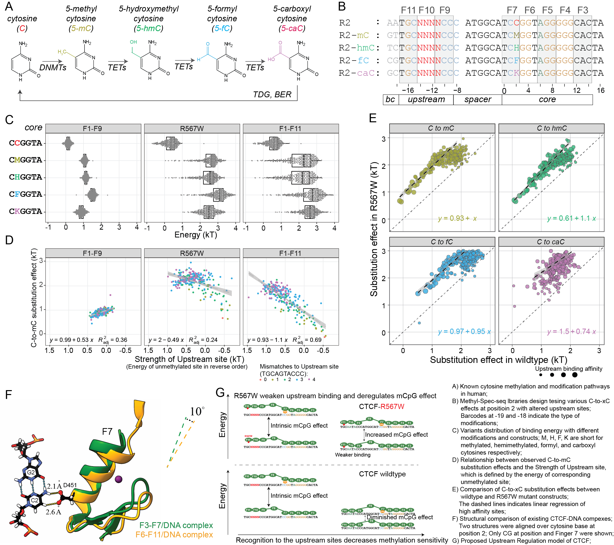

## figure 4 in the paper

```{r Classification of sequence into library type, message=FALSE, warning=FALSE, include=FALSE}
require(stringr)
require(dplyr)
require(tidyr)
require(readr)
require(ggplot2)
require(magrittr)
require(ggbeeswarm)
require(cowplot)
reference.CTCF = "AATGCAGTGCCCATGGCATCCGGTAGGGGGCACTA"

#save.image("CTCF_122320.Rdata")
load("../data/CTCF_122320.Rdata")

property_type <- function(seq) {
  if (str_detect(seq, "^AA") == TRUE) return("un")
  else if (str_detect(seq, "^AT") == TRUE) return("un")
  else if (str_detect(seq, "^GT") == TRUE) return("mC")
  else if (str_detect(seq, "^TC") == TRUE) return("hmC")
  else if (str_detect(seq, "^CG") == TRUE) return("fC")
  else if (str_detect(seq, "^GC") == TRUE) return("caC")
  else return("Unclassified")
}


library_type <- function(seq) {
  if(     str_detect(seq, "^ATGC....CCCAGTGGCATCCGGTAGGGGGCACTA") == TRUE) return("R2L")
  else if(str_detect(seq, "^AATGC....CCCATGGCATC.GGTAGGGGGCACTA") == TRUE) return("R2")
  else if(str_detect(seq, "^GTTGC....CCCATGGCATC.GGTAGGGGGCACTA") == TRUE) return("R2")
  else if(str_detect(seq, "^TCTGC....CCCATGGCATC.GGTAGGGGGCACTA") == TRUE) return("R2")
  else if(str_detect(seq, "^CGTGC....CCCATGGCATC.GGTAGGGGGCACTA") == TRUE) return("R2")
  else if(str_detect(seq, "^GCTGC....CCCATGGCATC.GGTAGGGGGCACTA") == TRUE) return("R2")
  else if(str_detect(seq, "^AATGC....CCCATGGCATCTTGTAGGGGGCACTA") == TRUE) return("R2-m1")
  else if(str_detect(seq, "^AATGC....CCCATGGCATGTTGTAGGGGGCACTA") == TRUE) return("R2-m2")
  else if(str_detect(seq, "^AATGC....CCCATGGCATGTTTTAGGGGGCACTA") == TRUE) return("R2-m3")
  else if(str_detect(seq, "^AA...AGTGCCCATGGCATC.GGTAGGGGGCACTA") == TRUE) return("R1")
  else if(str_detect(seq, "^AATGCAGTG...ATGGCATC.GGTAGGGGGCACTA") == TRUE) return("R3")
  else return("Unclassified")
}


CTCF.F1_F9.Sample1.processed %<>%
  mutate(Library = purrr::map_chr(Sequence, library_type)) %>%
  dplyr::filter((Property != "Unclassified") & (Library != "Unclassified") & (!str_detect(Sequence, "N")))

CTCF.F1_F9.Sample2.processed %<>%
  mutate(Library = purrr::map_chr(Sequence, library_type)) %>%
  dplyr::filter((Property != "Unclassified") & (Library != "Unclassified") & (!str_detect(Sequence, "N")))
 # dplyr::filter(Library == "R2", Property == "caC", Bound + Unbound > 50)

CTCF.F1_F11.Sample1.processed %<>%
  mutate(Library = purrr::map_chr(Sequence, library_type)) %>%
  dplyr::filter((Property != "Unclassified") & (Library != "Unclassified") & (!str_detect(Sequence, "N")))

CTCF.F1_F11.Sample2.processed %<>%
  mutate(Library = purrr::map_chr(Sequence, library_type)) %>%
  dplyr::filter((Property != "Unclassified") & (Library != "Unclassified") & (!str_detect(Sequence, "N")))

CTCF.R567W.Sample1.processed %<>%
  mutate(Library = purrr::map_chr(Sequence, library_type)) %>%
  dplyr::filter((Property != "Unclassified") & (Library != "Unclassified") & (!str_detect(Sequence, "N")))

CTCF.R567W.Sample2.processed %<>%
  mutate(Library = purrr::map_chr(Sequence, library_type)) %>%
  dplyr::filter((Property != "Unclassified") & (Library != "Unclassified") & (!str_detect(Sequence, "N")))
```


```{r}
CTCF.Total.processed <- 
  rbind(mutate(CTCF.F1_F9.Sample2.processed, Construct = "F1-F9", Sample = "Sample2"),
        mutate(CTCF.F1_F11.Sample1.processed, Construct = "F1-F11", Sample = "Sample1"),
        mutate(CTCF.R567W.Sample1.processed, Construct = "R567W", Sample = "Sample1")) %>%
  mutate(Property = factor(Property, levels = c("un", "mC", "hmC", "fC", "caC")),
         Core = factor(Core, levels = c("CCGGTAGGGGGCA", 
                                        "CAGGTAGGGGGCA",
                                        "CTGGTAGGGGGCA",
                                        "CGGGTAGGGGGCA",
                                        "CTTGTAGGGGGCA",
                                        "GTTGTAGGGGGCA",
                                        "GTTTTAGGGGGCA")))

CTCF.F1_F9.Sample2.processed %>%
  filter(Library %in% c("R2","R2-m1","R2-m2","R2-m3")，Property == "un") %>%
  tidyr::spread(Core, Energy) %>%
  group_by(Upstream) %>%
  summarise(Energy.un = sum(CCGGTAGGGGGCA, na.rm = TRUE),
            C_T  = sum(CTGGTAGGGGGCA, na.rm = TRUE) - sum(CCGGTAGGGGGCA, na.rm = TRUE),
            C_A  = sum(CAGGTAGGGGGCA, na.rm = TRUE) - sum(CCGGTAGGGGGCA, na.rm = TRUE),
            C_G  = sum(CGGGTAGGGGGCA, na.rm = TRUE) - sum(CCGGTAGGGGGCA, na.rm = TRUE),
            C_m1 = sum(CTTGTAGGGGGCA, na.rm = TRUE) - sum(CCGGTAGGGGGCA, na.rm = TRUE),
            C_m2 = sum(GTTGTAGGGGGCA, na.rm = TRUE) - sum(CCGGTAGGGGGCA, na.rm = TRUE),
            C_m3 = sum(GTTTTAGGGGGCA, na.rm = TRUE) - sum(CCGGTAGGGGGCA, na.rm = TRUE),) %>%
  gather(`C_T`, `C_A`, `C_G`, `C_m1`, `C_m2`, `C_m3`, key = "Type", value = "Effect") -> CTCF.F1_F9.Sample2.merged1

CTCF.F1_F9.Sample2.processed %>%
  filter(Library == "R2"，Core == "CCGGTAGGGGGCA") %>%
  tidyr::spread(Property, Energy) %>%
  group_by(Upstream) %>%
  summarise(Energy.un = sum(un, na.rm = TRUE),
            mC = sum(mC, na.rm = TRUE)-sum(un, na.rm = TRUE),
            hmC= sum(hmC, na.rm = TRUE)-sum(un, na.rm = TRUE),
            fC = sum(fC, na.rm = TRUE)-sum(un, na.rm = TRUE),
            caC = sum(fC, na.rm = TRUE)-sum(un, na.rm = TRUE)) %>%
  gather(`mC`, `hmC`, `fC`, `caC`, key = "Type", value = "Effect") -> CTCF.F1_F9.Sample2.merged2

rbind(CTCF.F1_F9.Sample2.merged1, CTCF.F1_F9.Sample2.merged2) %>% mutate(Construct="F1-F9") -> CTCF.F1_F9.Sample2.merged


CTCF.F1_F11.Sample1.processed %>%
  filter(Library %in% c("R2","R2-m1","R2-m2","R2-m3")，Property == "un") %>%
  tidyr::spread(Core, Energy) %>%
  group_by(Upstream) %>%
  summarise(Energy.un = sum(CCGGTAGGGGGCA, na.rm = TRUE),
            C_T  = sum(CTGGTAGGGGGCA, na.rm = TRUE) - sum(CCGGTAGGGGGCA, na.rm = TRUE),
            C_A  = sum(CAGGTAGGGGGCA, na.rm = TRUE) - sum(CCGGTAGGGGGCA, na.rm = TRUE),
            C_G  = sum(CGGGTAGGGGGCA, na.rm = TRUE) - sum(CCGGTAGGGGGCA, na.rm = TRUE),
            C_m1 = sum(CTTGTAGGGGGCA, na.rm = TRUE) - sum(CCGGTAGGGGGCA, na.rm = TRUE),
            C_m2 = sum(GTTGTAGGGGGCA, na.rm = TRUE) - sum(CCGGTAGGGGGCA, na.rm = TRUE),
            C_m3 = sum(GTTTTAGGGGGCA, na.rm = TRUE) - sum(CCGGTAGGGGGCA, na.rm = TRUE),) %>%
  gather(`C_T`, `C_A`, `C_G`, `C_m1`, `C_m2`, `C_m3`, key = "Type", value = "Effect") -> CTCF.F1_F11.Sample1.merged1

CTCF.F1_F11.Sample1.processed %>%
  filter(Library == "R2"，Core == "CCGGTAGGGGGCA") %>%
  tidyr::spread(Property, Energy) %>%
  group_by(Upstream) %>%
  summarise(Energy.un = sum(un, na.rm = TRUE),
            mC = sum(mC, na.rm = TRUE)-sum(un, na.rm = TRUE),
            hmC= sum(hmC, na.rm = TRUE)-sum(un, na.rm = TRUE),
            fC = sum(fC, na.rm = TRUE)-sum(un, na.rm = TRUE),
            caC = sum(fC, na.rm = TRUE)-sum(un, na.rm = TRUE)) %>%
  gather(`mC`, `hmC`, `fC`, `caC`, key = "Type", value = "Effect") -> CTCF.F1_F11.Sample1.merged2

rbind(CTCF.F1_F11.Sample1.merged1, CTCF.F1_F11.Sample1.merged2) %>% mutate(Construct="F1-F11") -> CTCF.F1_F11.Sample1.merged


CTCF.R567W.Sample1.processed %>%
  filter(Library %in% c("R2","R2-m1","R2-m2","R2-m3")，Property == "un") %>%
  tidyr::spread(Core, Energy) %>%
  group_by(Upstream) %>%
  summarise(Energy.un = sum(CCGGTAGGGGGCA, na.rm = TRUE),
            C_T  = sum(CTGGTAGGGGGCA, na.rm = TRUE) - sum(CCGGTAGGGGGCA, na.rm = TRUE),
            C_A  = sum(CAGGTAGGGGGCA, na.rm = TRUE) - sum(CCGGTAGGGGGCA, na.rm = TRUE),
            C_G  = sum(CGGGTAGGGGGCA, na.rm = TRUE) - sum(CCGGTAGGGGGCA, na.rm = TRUE),
            C_m1 = sum(CTTGTAGGGGGCA, na.rm = TRUE) - sum(CCGGTAGGGGGCA, na.rm = TRUE),
            C_m2 = sum(GTTGTAGGGGGCA, na.rm = TRUE) - sum(CCGGTAGGGGGCA, na.rm = TRUE),
            C_m3 = sum(GTTTTAGGGGGCA, na.rm = TRUE) - sum(CCGGTAGGGGGCA, na.rm = TRUE),) %>%
  gather(`C_T`, `C_A`, `C_G`, `C_m1`, `C_m2`, `C_m3`, key = "Type", value = "Effect") -> CTCF.R567W.Sample1.merged1

CTCF.R567W.Sample1.processed %>%
  filter(Library == "R2"，Core == "CCGGTAGGGGGCA") %>%
  tidyr::spread(Property, Energy) %>%
  group_by(Upstream) %>%
  summarise(Energy.un = sum(un, na.rm = TRUE),
            mC = sum(mC, na.rm = TRUE)-sum(un, na.rm = TRUE),
            hmC= sum(hmC, na.rm = TRUE)-sum(un, na.rm = TRUE),
            fC = sum(fC, na.rm = TRUE)-sum(un, na.rm = TRUE),
            caC = sum(fC, na.rm = TRUE)-sum(un, na.rm = TRUE)) %>%
  gather(`mC`, `hmC`, `fC`, `caC`, key = "Type", value = "Effect") -> CTCF.R567W.Sample1.merged2

rbind(CTCF.R567W.Sample1.merged1, CTCF.R567W.Sample1.merged2) %>% mutate(Construct="R567W") -> CTCF.R567W.Sample1.merged

```


## Overview of energy distribution of variants with different epigenetic modifications

```{r fig.height=7, fig.width=8, message=FALSE, warning=FALSE}
Upstream.levels <- (CTCF.F1_F11.Sample1.processed %>%
                      dplyr::filter(Library == "R2", Property == "un", Core == "CCGGTAGGGGGCA", !str_detect(Sequence, "N")) %>%
                      dplyr::arrange(desc(Energy)))$Upstream

CTCF.Total.processed %>%
  filter(Library == "R2", Core %in% c("CCGGTAGGGGGCA", "CMGGTAGGGGGCA", "CHGGTAGGGGGCA", "CFGGTAGGGGGCA", "CKGGTAGGGGGCA")) %>%
  ggplot(aes(y = Property, x = Energy), color = "black", show.legend = FALSE) +
  geom_boxplot(notch = FALSE, outlier.shape = NA, color = "black") +
  geom_quasirandom(aes(), size = 0.5, alpha = 0.8, groupOnX = FALSE) +
  theme_bw() + theme(legend.position = "none", panel.grid.minor = element_blank(), axis.title.y = element_blank()) +
  xlab("Energy (kT)") + ylab("Property of Cytosine at position 2") + xlim(-0.9, 4) +
  labs(color = "", shape = "") + scale_y_discrete(limits = rev) +
  facet_wrap(~factor(Construct, levels = c("F1-F9", "R567W", "F1-F11")), ncol = 3) -> p1

rbind(CTCF.F1_F9.Sample2.merged, CTCF.F1_F11.Sample1.merged, CTCF.R567W.Sample1.merged) %>%
  mutate(Construct = factor(Construct, levels = c("F1-F9", "R567W", "F1-F11")),
         Type = case_when(Type == "mC"   ~ "C to mC",
                          Type == "hmC"  ~ "C to hmC",
                          Type == "fC"   ~ "C to fC",
                          Type == "caC"  ~ "C to caC",
                          Type == "C_G"  ~ "CCGGT to CGGGT",
                          Type == "C_T"  ~ "CCGGT to CTGGT",
                          Type == "C_A"  ~ "CCGGT to CAGGT",
                          Type == "C_m1" ~ "CCGGT to CTTGT",
                          Type == "C_m2" ~ "CCGGT to GTTGT",
                          Type == "C_m3" ~ "CCGGT to GTTTT",)) %>%
  mutate(Type = factor(Type, levels = c("C to mC", "C to hmC", "C to fC", "C to caC", 
                                        "CCGGT to CAGGT", "CCGGT to CGGGT", "CCGGT to CTGGT",
                                        "CCGGT to CTTGT", "CCGGT to GTTGT", "CCGGT to GTTTT")),
         Upstream = factor(Upstream, levels = Upstream.levels)) %>%
  filter(Type %in% c("C to mC")) %>%
  ggplot(aes(x = Energy.un,
             y = Effect, color = Construct)) +
  geom_point(size = 0.45) +
  ggpubr::stat_regline_equation(label.x = -1.5, label.y = 0, colour = "black",
                                aes(label = paste(..eq.label.., ..adj.rr.label.., sep = "~~~~"))) +
  geom_smooth(method = "lm", se=TRUE, formula = y ~ x, linetype = "dashed") +
  xlim(1.5, -0.8) + 
  ylim(-0.3, 3) +
  xlab("Strength of Upstream site (kT)\n (-Energy of unmethylated site with reference Core CCGGT)") +
  ylab("Observed C-to-mC substitution effect (kT)") +
  scale_color_manual(values=c("#A3A500", "#A3A500", "#A3A500")) +
  guides(colour = FALSE) + theme_bw() +
  theme(legend.position = "bottom") +
  facet_wrap(~Construct, ncol = 1) -> plot.CtomC

rbind(CTCF.F1_F9.Sample2.merged, CTCF.F1_F11.Sample1.merged, CTCF.R567W.Sample1.merged) %>%
  mutate(Construct = factor(Construct, levels = c("F1-F9", "R567W", "F1-F11")),
         Type = case_when(Type == "mC"   ~ "C to mC",
                          Type == "hmC"  ~ "C to hmC",
                          Type == "fC"   ~ "C to fC",
                          Type == "caC"  ~ "C to caC",
                          Type == "C_G"  ~ "CCGGT to CGGGT",
                          Type == "C_T"  ~ "CCGGT to CTGGT",
                          Type == "C_A"  ~ "CCGGT to CAGGT",
                          Type == "C_m1" ~ "CCGGT to CTTGT",
                          Type == "C_m2" ~ "CCGGT to GTTGT",
                          Type == "C_m3" ~ "CCGGT to GTTTT",)) %>%
  mutate(Type = factor(Type, levels = c("C to mC", "C to hmC", "C to fC", "C to caC", 
                                        "CCGGT to CAGGT", "CCGGT to CGGGT", "CCGGT to CTGGT",
                                        "CCGGT to CTTGT", "CCGGT to GTTGT", "CCGGT to GTTTT")),
         Upstream = factor(Upstream, levels = Upstream.levels)) %>%
  filter(Type %in% c("C to mC")) %>%
  mutate(Mismatch.Upstream = factor(TFCookbook::countMismatch(as.character(Upstream), 'TGCAGTACCC'))) %>%
  ggplot(aes(x = Energy.un,
             y = Effect)) +
  geom_point(aes(color = Mismatch.Upstream), size = 0.9) +
  ggpubr::stat_regline_equation(label.x = -1.5, label.y = -0.25, colour = "black",
                                aes(label = paste(..eq.label.., ..adj.rr.label.., sep = "~~~"))) +
  ggpubr::stat_cor(label.x = -1.5, label.y = 0.25, colour = "black",
                                aes()) +
  geom_smooth(method = "lm", se=TRUE, formula = y ~ x, linetype = "dashed", color = "grey") +
  xlim(1.5, -0.8) + 
  ylim(-0.3, 3) +
  xlab("Strength of Upstream site (kT)\n (-Energy of unmethylated site with reference Core CCGGT)") +
  ylab("Observed C-to-mC substitution effect (kT)") +
  #scale_color_manual(values=c("#A3A500", "#A3A500", "#A3A500")) +
  theme_bw() +
  theme(panel.grid.minor = element_blank(), legend.position = "bottom") +
  guides(col = guide_legend(nrow = 2)) +
  facet_wrap(~Construct, ncol = 3) -> p2

cowplot::plot_grid(p1, p2, nrow = 2,
                   align = "v", axis = "lr", rel_heights = c(1, 1.3))

ggsave("Comparison of methylation effects 4.svg",  plot = last_plot(), width = 8, height = 7)
```

## Comparison of epigenetic effect between wildtype CTCF and R567W mutant
```{r message=FALSE, warning=FALSE, fig.height=6, fig.width=5}
inner_join(CTCF.R567W.Sample1.merged, CTCF.F1_F11.Sample1.merged,
           by = c("Upstream", "Type"),
           suffix = c(".R567W", ".F1_F11")) %>%
  mutate(Type = factor(Type, levels = c("mC", "hmC", "fC", "caC", "C_G", "C_T", "C_A"))) %>%
  filter(Type %in% c("mC", "hmC", "fC", "caC")) %>%
  ggplot(aes(x = Effect.F1_F11,
             y = Effect.R567W, color = Type,
             size = exp(-Energy.un.F1_F11))) +
  geom_point(alpha = 0.8) +
  ggpubr::stat_regline_equation(label.x = 0.55, label.y = -0.2, aes(label = ..eq.label..), color = "black",
                                data = function(x) filter(x, Energy.un.F1_F11<0.4)) +
  ggpubr::stat_cor(label.x = 0.55, label.y = 0.25, aes(), color = "black",
                                data = function(x) filter(x, Energy.un.F1_F11<0.4)) +
  geom_smooth(method = "lm", se=TRUE, linetype = "dashed", formula = y~x, color = "black",
                                data = function(x) filter(x, Energy.un.F1_F11<0.4), show.legend = FALSE) +
  geom_abline(intercept = 0, slope = 1, linetype = "dashed") +
  scale_size_binned(range = c(0.1, 1.5)) +
  xlim(-0.3, 3) + ylim(-0.3, 3) +
  xlab("Substitution effects in wildtype (kT)") +
  ylab("Substitution effects in R567W mutant (kT)") +
  scale_color_manual(values=c("#A3A500", "#00BF7D", "#00B0F6", "#E76BF3", "#DA9030", "#000000", "#2E9682")) +
  guides(colour = FALSE) + theme_bw()+
  coord_fixed() +
  theme(legend.position = "bottom", panel.grid.minor = element_blank()) +
  facet_wrap(~Type, ncol = 2)

#ggsave("Comparison of modification effects between wildtype and R567W_3.svg", width = 5.7, height = 6)
```

## Display of epigenetic effects with different upstream sites ranked from low to high affinity

```{r fig.height=6.5, fig.width=11, message=FALSE, warning=FALSE}
Upstream.levels <- (CTCF.F1_F11.Sample1.processed %>%
                      dplyr::filter(Library == "R2", Property == "un", Core == "CCGGTAGGGGGCA", !str_detect(Sequence, "N")) %>%
                      dplyr::arrange(desc(Energy)))$Upstream

CTCF.Total.processed %>%
  filter(Library == "R2", Property %in% c("un", "mC", "hmC", "fC", "caC"), Core == "CCGGTAGGGGGCA", Upstream %in% Upstream.levels[seq(4, 256, 3)]) %>%
  mutate(Upstream = factor(Upstream, level = Upstream.levels)) %>%
  ggplot() +
    geom_point(aes(x = Upstream, y = Energy, color = Property, shape = Property), size = 1, show.legend = FALSE)+
   # geom_smooth(aes(x = as.numeric(Upstream), y = Energy, color = Property), size = 1, show.legend = FALSE) +
    scale_x_discrete(breaks = Upstream.levels[seq(4, 256, 6)]) +
    xlab("Upstream sequences in R2 libraries \n ranked from low to high by energy of unmethylated sites in F1-F11 experiment") +
    ylim(-0.9, 4) + theme_bw()+
    theme(axis.text.x = element_text(angle = 90, vjust = 0.38, family = "mono"), axis.title.y = element_blank()) +
    facet_wrap(~factor(Construct, levels = c("F1-F9", "R567W", "F1-F11")), ncol = 1) -> p1

CTCF.Total.processed %>%
  filter(Library == "R2", Core == "CCGGTAGGGGGCA") %>%
  ggplot(aes(x = Property, y = Energy, color = Property)) +
  geom_boxplot(notch = FALSE, outlier.shape = NA, color = "black") +
  geom_quasirandom(aes(shape = Property), size = 0.5, alpha = 0.8) + theme_bw()+
  theme(legend.position = "bottom", panel.grid.minor = element_blank()) +
  ylab("Energy (kT)") + xlab("Property of Cytosine at position 2") + ylim(-0.9, 4) +
  labs(color = "", shape = "") + 
  facet_wrap(~factor(Construct, levels = c("F1-F9", "R567W", "F1-F11")), ncol = 1) -> p2


cowplot::plot_grid(p2, p1, plot.CtomC,
          ncol = 3, align = "h", axis = "bt", rel_widths = c(1.0, 2, 1))

#ggsave("Comparison of methylation effects(descending order).svg", width = 11, height = 6.5)
```


```{r fig.height=7.5, fig.width=10.5, message=FALSE, warning=FALSE}
Upstream.levels <- (CTCF.F1_F11.Sample1.processed %>%
                      dplyr::filter(Library == "R2", Property == "un", Core == "CCGGTAGGGGGCA", !str_detect(Sequence, "N")) %>%
                      dplyr::arrange(desc(Energy)))$Upstream

rbind(CTCF.F1_F9.Sample2.merged, CTCF.F1_F11.Sample1.merged, CTCF.R567W.Sample1.merged) %>%
  mutate(Construct = factor(Construct, levels = c("F1-F9", "R567W", "F1-F11")),
         Type = case_when(Type == "mC"   ~ "C to mC",
                          Type == "hmC"  ~ "C to hmC",
                          Type == "fC"   ~ "C to fC",
                          Type == "caC"  ~ "C to caC",
                          Type == "C_G"  ~ "CCGGT to CGGGT",
                          Type == "C_T"  ~ "CCGGT to CTGGT",
                          Type == "C_A"  ~ "CCGGT to CAGGT",
                          Type == "C_m1" ~ "CCGGT to CTTGT",
                          Type == "C_m2" ~ "CCGGT to GTTGT",
                          Type == "C_m3" ~ "CCGGT to GTTTT",)) %>%
  mutate(Type = factor(Type, levels = c("C to mC", "C to hmC", "C to fC", "C to caC", 
                                        "CCGGT to CAGGT", "CCGGT to CGGGT", "CCGGT to CTGGT",
                                        "CCGGT to CTTGT", "CCGGT to GTTGT", "CCGGT to GTTTT")),
         Upstream = factor(Upstream, levels = Upstream.levels)) %>%
  filter(Type %in% c("C to mC", "C to hmC", "C to fC", "C to caC")) %>%
  ggplot(aes(x = Energy.un,
             y = Effect, color = Type)) +
  geom_point(size = 1) +
  ggpubr::stat_regline_equation(label.x = -1.5, label.y = 0,
                                aes(label = paste(..eq.label.., ..adj.rr.label.., sep = "~~"))) +
  geom_smooth(method = "lm", se=TRUE, formula = y ~ x, linetype = "dashed") +
  xlim(1.5, -0.8) + 
  ylim(-0.3, 3.5) +
  xlab("Strength of Upstream site (kT)\n (-Energy of unmethylated site with reference Core CCGGT)") +
  ylab("Observed substitution effect (kT)") +
  scale_color_manual(values=c("#A3A500", "#00BF7D", "#00B0F6", "#E76BF3")) +
  guides(colour = FALSE) + theme_bw()+
  theme(legend.position = "bottom") +
  facet_grid(Construct ~ Type) 


#ggsave("Comparison of methylation effects(descending order,shades)2.svg", width = 11, height = 6)
```


