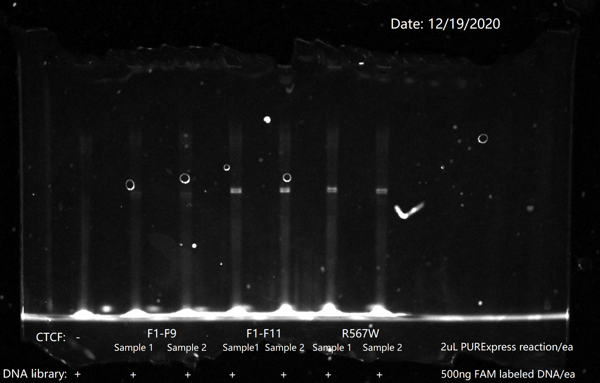

## Introduction
This sub-repository of ZFPCookbook contains all the processed data and analysis workflow of CTCF in R for our upcoming paper ["Quantitative analysis of ZFY and CTCF reveals dependent recognition of tandem zinc finger proteins"](https://www.biorxiv.org/content/10.1101/637298v2), which was partly done at Stormo lab and Fordyce lab during my stay at WashU and Stanford. The raw sequencing data has been deposited at [NCBI GEO database](https://www.ncbi.nlm.nih.gov/geo/query/acc.cgi?acc=GSE188166). The structural comparison model between two CTCF constructs (PDB #5KKQ, #5YEL) can be accessed at [Structural comparison model](https://github.com/zeropin/ZFPCookbook/blob/master/CTCF/data/Structural%20comparison%20(2022).cxs).

Please contact me <zeropin@live.cn> if you have any question.

## Background and Experimental Design

CTCF, the well-established genome insulator in vertebrates, consists of 11 conserved C2H2- zinc fingers and is known to be sensitive to CpG methylation at specific position within the core motif. In 2013, it was reported that codon mutation R567W located at finger 11 can cause intellectural disabilities and autisms [(Gregor et. al)](https://pubmed.ncbi.nlm.nih.gov/23746550/), and the current mainstream thinking is the disease phenotype is driven by haploinsufficiency.

In recent years, more missense mutations have been identified [(Enrico et. al)](https://pubmed.ncbi.nlm.nih.gov/31239556/) and parts of the structures (F2 to F7, F6 to F11) in complex with DNA have been solved [(Hashimoto et. al)](https://pubmed.ncbi.nlm.nih.gov/28529057/) [(Yin et.al)](https://pubmed.ncbi.nlm.nih.gov/29076501/), so I created a chimera structural model based on two separate structures (pdb [#5T0U](https://www.rcsb.org/structure/5T0U) and [#5YEL](https://www.rcsb.org/structure/5YEL)) and mapped currently known disease variants onto the structure (colored red), which showed clear structure-function correlation, i.e., all identified disease variants are located at those base-touching fingers.

Also it is well established that CTCF is sensitive to CpG methylation [(Hark et. al)](https://pubmed.ncbi.nlm.nih.gov/10839547/), which is important to the regulation of some biological processes such as epigenetic silencing and imprinting control [(Schoenherr et. al)](https://www.nature.com/articles/ng1057z). However, there has been no systematic study of CTCF's response to other types of DNA modifications,  e.g., hydroxylmethylation (hmC), formylation (fC), and carboxylation (caC).

Given my previous work about ZFY, CTCF, and ZNF343, I want to specifically address following questions:

1) Is there any mutual influence between the upstream motif recognition and core site specificity and methylation sensitivity?

2) How does the R567W mutation change the upstream motif? Does that also exert some allosteric effect over the core site recognition?

3) Besides cytosine methylation, how other types of DNA modifiations (hmC, fC, caC) can affect the binding affinitities of CTCF? Are they also subject to some allosteric effect by the upstream site recognition?

### Libraries design

To address above questions, I built three protein constructs, i.e., hisHALO-CTCF(F1-F9) as negative control, hisHALO-CTCF(F1-F11), and hisHALO-CTCF-R567W, and succesfully used NEB in-vitro expression system to make the proteins for DNA binding and EMSA separations. Also I designed following sequencing libraries to randomize different positions of upstream sequence (R1, R2, and R3) with position 2 in Core site randomized simutaneously. Some previous work showed CpG methylation effect at position 2 and 3 is primarily caused by cytosine methylation at position 2, so I introduced different types of modifications to the upper strand of DNA duplex at position 2 in R2 libraries (R2-mC, hmC, fC, and caC), wheares each type of modification is associated with some unique barcodes at position 18-19 for sequencing readout and identification.

### EMSA separation

