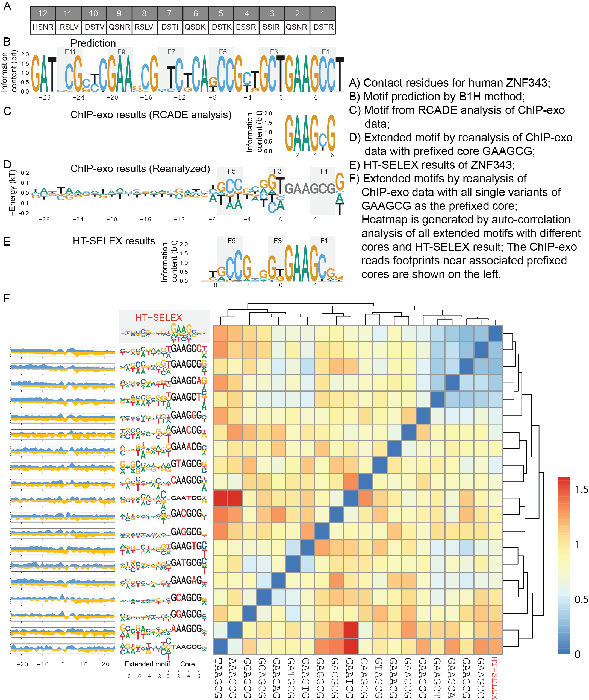

# ZFPCookbook
This repository contains all the data analysis workflow of Zinc finger proteins (ZFPs) in my published and to-be-published work, including CTCF, ZNF343, ZNF140, ZNF675, etc. Please contact me if you have any question.

Zheng Zuo
zeropin@live.cn
