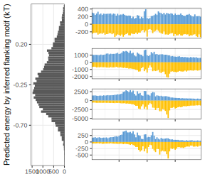

.png)
```{r message=FALSE, warning=FALSE}
require(dplyr)
require(GenomicRanges)
require(TFCookbook)
require(ggplot2)

anchor = "AACAGAAA"
upstream_flank  = 7
downstream_flank= 18
border_width = 35

ZIM3.peaks <- genomation::readBed("ChIP-exo data/MACS/ZIM3_peaks.narrowPeak")

load("ZIM3.Model.AACAGAAA.RData")
PEM.AACAGAAA <- as.PEM(Model.AACAGAAA)

Exo.plus = "ChIP-exo data/ZIM3.plus.bigwig"
Exo.minus= "ChIP-exo data/ZIM3.minus.bigwig"
```


## Plotting aggregate ChIP-exo footprints with fixed core

```{r}
makeFootprints <- function(sites){
  colNum  = nchar(anchor)+2*border_width
  windows = promoters(sites, upstream = border_width,downstream =nchar(anchor)+border_width)
  
  if(!isEmpty(import.bw(Exo.plus, which = windows))){
      Reads.plus <- genomation::ScoreMatrix(target = Exo.plus, strand.aware = TRUE, unique = FALSE,
                                            windows= windows)@.Data %>% matrix(ncol = colNum)}
  else
      Reads.plus <- matrix(0L, nrow = length(sites), ncol = colNum)
      
  
  if(!isEmpty(import.bw(Exo.minus, which = windows))){
      Reads.minus<- genomation::ScoreMatrix(target = Exo.minus, strand.aware = TRUE, unique=FALSE,
                              windows= windows)@.Data %>% matrix(ncol = colNum)}
  else
      Reads.minus<- matrix(0L, nrow = length(sites), ncol = nchar(anchor)+2*border_width)
  
  return(tibble(position=-(border_width+floor(nchar(anchor)/2)):(ceiling(nchar(anchor)/2)+border_width-1),
                Reads.Forward= .colSums(Reads.plus[which(sites@strand=="+"),],
                                        m = length(which(sites@strand=="+")),
                                        n = colNum)+
                                .colSums(Reads.minus[which(sites@strand=="-"),],
                                        m = length(which(sites@strand=="-")),
                                        n = colNum),
                Reads.Reverse= .colSums(Reads.plus[which(sites@strand=="-"),],
                                        m = length(which(sites@strand=="-")),
                                        n = colNum)+
                               .colSums(Reads.minus[which(sites@strand=="+"),],
                                        m = length(which(sites@strand =="+")),
                                        n = colNum)
                      ))
}
```


```{r fig.height=3, fig.width=6, message=FALSE, warning=FALSE}
plotFootprints <- function(anchor, PEM = PEM.AACAGAAA, save = TRUE){
  Sites = TFCookbook::matchSite(site = anchor,
                                subject=ZIM3.peaks,
                                genome="hg38")
          #subset(seqnames %in% rownames(ZIM3_exo_reads_by_chrome_strand))

  Sites$Sequence = getSeq(x = BSgenome.Hsapiens.UCSC.hg38,
                          names = promoters(Sites,
                                            upstream = upstream_flank, downstream = nchar(anchor)+downstream_flank-6),
                          as.character = TRUE)

  Sites$predicted.Energy = TFCookbook::predictEnergy(Sites$Sequence, PEM)

  Sites %>%
  subset(predicted.Energy < (-0.7)) %>%
  makeFootprints() %>%
  ggplot()+
    geom_bar(aes(x=position, weight=Reads.Forward), fill="#5B9Bd5") +
    geom_bar(aes(x=position, weight=-Reads.Reverse), fill="#FFC000") +
    #  xlim(-39,31) + ylim(-550, 450) +
    xlab("Relative position (bp)") +
    scale_x_continuous(expand = c(0,0))+
    theme_bw() + theme(axis.title.x = element_blank(), axis.title.y = element_blank(),
                       axis.text.x  = element_blank(),
                       panel.grid.minor.y = element_blank()) -> plot.Zone1
  Sites %>%
  subset(between(predicted.Energy, -0.7, -0.25)) %>%
  makeFootprints() %>%
  ggplot()+
    geom_bar(aes(x=position, weight=Reads.Forward), fill="#5B9Bd5") +
    geom_bar(aes(x=position, weight=-Reads.Reverse), fill="#FFC000") +
#  xlim(-39,31) + ylim(-550, 450) +
    xlab("Relative position (bp)") +
    scale_x_continuous(expand = c(0,0))+
    theme_bw() + theme(axis.title.x = element_blank(), axis.title.y = element_blank(),
                       axis.text.x  = element_blank(),
                       panel.grid.minor.y = element_blank()) -> plot.Zone2

  Sites %>%
  subset(between(predicted.Energy, -0.25, 0.2)) %>%
  makeFootprints() %>%
  ggplot()+
    geom_bar(aes(x=position, weight=Reads.Forward), fill="#5B9Bd5") +
    geom_bar(aes(x=position, weight=-Reads.Reverse), fill="#FFC000") +
#  xlim(-39,31) + ylim(-550, 450) +
    xlab("Relative position (bp)") +
    scale_x_continuous(expand = c(0,0))+
    theme_bw() + theme(axis.title.x = element_blank(), axis.title.y = element_blank(),
                       axis.text.x  = element_blank(),
                       panel.grid.minor.y = element_blank()) -> plot.Zone3

  Sites %>%
  subset(predicted.Energy > 0.2) %>%
  makeFootprints() %>%
  ggplot()+
    geom_bar(aes(x=position, weight=Reads.Forward), fill="#5B9Bd5") +
    geom_bar(aes(x=position, weight=-Reads.Reverse), fill="#FFC000") +
#  xlim(-39,31) + ylim(-550, 450) +
    xlab("Relative position (bp)") +
    scale_x_continuous(expand = c(0,0))+
    theme_bw() + theme(axis.title.x = element_blank(), axis.title.y = element_blank(),
                       axis.text.x  = element_blank(),
                       panel.grid.minor.y = element_blank()) -> plot.Zone4

  cowplot::plot_grid(plot.Zone4,
                     plot.Zone3,
                     plot.Zone2,
                     plot.Zone1,
                     align = "v",
                     nrow = 4) -> plot.Footprints
  
  Sites %>% as_tibble() %>%
    ggplot(aes(x = predicted.Energy, y = ..count..), size = .2, alpha = 0.1)+
      geom_histogram(bins = 70) +
      theme_bw() + theme(axis.title.x = element_blank(),
                         panel.grid.minor = element_blank()) +
      xlab("Predicted energy by inferred flanking motif (kT)")+
      scale_x_continuous(breaks = c(-0.7, -0.25, 0.2 ), limits = c(-1.15, 0.65), expand = c(0,0)) +
      scale_y_reverse(expand = expansion(mult = c(0.05, 0)))+
      coord_flip() -> plot.Distribution
  #facet_wrap(~Group, ncol=1, strip.position = "right", scales = "free_y") -> plot.Distribution

  cowplot::plot_grid(plot.Distribution,
                     plot.Footprints,
                     ncol = 2, align = "h", rel_widths = c(1, 2.5)) -> plot.combined
  
  if(save==TRUE)
    ggsave(plot = plot.combined,
           filename = paste0("Footprints plots/Footprinting with anchor (",anchor,").svg"), height = 3.5, width = 5)
  else
    plot.combined
}


plotFootprints("AACAGAAT", save = FALSE)
```


```{r message=FALSE, warning=FALSE}
(singleVariants = TFCookbook::selectVariants(reference = "AACAGAAA", maxMismatches = 1))
```

```{r eval=FALSE}
lapply(singleVariants, plotFootprints)
```


## Plotting aggregate ChIP-exo footprints with three classes of cores
```{r}
plotFootprintsWithMultipleAnchor <- function(anchors, PEM = PEM.AACAGAAA, save){
  Sites <- lapply(anchors, function(anchor) matchSite(anchor, subject = ZIM3.peaks, genome = "hg38")) %>%
           do.call("c",.)
         #  subset(seqnames %in% rownames(ZIM3_exo_reads_by_chrome_strand))

  Sites$Sequence = getSeq(x = BSgenome.Hsapiens.UCSC.hg38,
                          names = promoters(Sites,
                                            upstream = upstream_flank, downstream = nchar(anchor)+downstream_flank-6),
                          as.character = TRUE)
  Sites$predicted.Energy = TFCookbook::predictEnergy(Sites$Sequence, PEM)

  Sites %>%
  subset(predicted.Energy < (-0.7)) %>%
  makeFootprints() %>%
  ggplot()+
    geom_bar(aes(x=position, weight=Reads.Forward), fill="#5B9Bd5") +
    geom_bar(aes(x=position, weight=-Reads.Reverse), fill="#FFC000") +
    #  xlim(-39,31) + ylim(-550, 450) +
    xlab("Relative position (bp)") +
    scale_x_continuous(expand = c(0,0))+
    theme_bw() + theme(axis.title.x = element_blank(), axis.title.y = element_blank(),
                       axis.text.x  = element_blank(),
                       panel.grid.minor.y = element_blank()) -> plot.Zone1

  Sites %>%
  subset(between(predicted.Energy, -0.7, -0.25)) %>%
  makeFootprints() %>%
  ggplot()+
    geom_bar(aes(x=position, weight=Reads.Forward), fill="#5B9Bd5") +
    geom_bar(aes(x=position, weight=-Reads.Reverse), fill="#FFC000") +
#  xlim(-39,31) + ylim(-550, 450) +
    xlab("Relative position (bp)") +
    scale_x_continuous(expand = c(0,0))+
    theme_bw() + theme(axis.title.x = element_blank(), axis.title.y = element_blank(),
                       axis.text.x  = element_blank(),
                       panel.grid.minor.y = element_blank()) -> plot.Zone2

  Sites %>%
  subset(between(predicted.Energy, -0.25, 0.2)) %>%
  makeFootprints() %>%
  ggplot()+
    geom_bar(aes(x=position, weight=Reads.Forward), fill="#5B9Bd5") +
    geom_bar(aes(x=position, weight=-Reads.Reverse), fill="#FFC000") +
#  xlim(-39,31) + ylim(-550, 450) +
    xlab("Relative position (bp)") +
    scale_x_continuous(expand = c(0,0))+
    theme_bw() + theme(axis.title.x = element_blank(), axis.title.y = element_blank(),
                       axis.text.x  = element_blank(),
                       panel.grid.minor.y = element_blank()) -> plot.Zone3

  Sites %>%
  subset(predicted.Energy > 0.2) %>%
  makeFootprints %>%
  ggplot()+
    geom_bar(aes(x=position, weight=Reads.Forward), fill="#5B9Bd5") +
    geom_bar(aes(x=position, weight=-Reads.Reverse), fill="#FFC000") +
#  xlim(-39,31) + ylim(-550, 450) +
    xlab("Relative position (bp)") +
    scale_x_continuous(expand = c(0,0))+
    theme_bw() + theme(axis.title.x = element_blank(), axis.title.y = element_blank(),
                       axis.text.x  = element_blank(),
                       panel.grid.minor.y = element_blank()) -> plot.Zone4

  cowplot::plot_grid(plot.Zone4,
                     plot.Zone3,
                     plot.Zone2,
                     plot.Zone1,
                     align = "v",
                     nrow = 4) -> plot.Footprints
  
  Sites %>% as_tibble() %>%
    ggplot(aes(x = predicted.Energy, y = ..count..), size = .2, alpha = 0.1)+
      geom_histogram(bins = 70) +
      theme_bw() + theme(axis.title.x = element_blank(),
                         panel.grid.minor = element_blank()) +
      xlab("Predicted energy by inferred flanking motif (kT)")+
      scale_x_continuous(breaks = c(-0.7, -0.25, 0.2 ), limits = c(-1.15, 0.65), expand = c(0,0)) +
      scale_y_reverse(expand = expansion(mult = c(0.05, 0)))+
      coord_flip() -> plot.Distribution

  cowplot::plot_grid(plot.Distribution,
                     plot.Footprints,
                     ncol = 2, align = "h", rel_widths = c(1, 2)) -> plot.combined
  if(missing(save))
    plot.combined
  else
    ggsave(plot = plot.combined,
           filename = paste0("Footprints plots/Footprinting with ",save," anchors.svg"), height = 3.5, width = 4)
}


```


```{r}
regular.Seqnames = paste0("chr", c(1:23,"X","Y"))

Good.Cores = c("AACAGAAC", "AAAAGAAA", "AACAGAAA", "AACAGAAT", "AACAGCAA", "AACAGAAG", "ATCAGAAA", "AAGAGAAA")
Bad.Cores  = c("AACATAAA", "AACTGAAA", "AACCGAAA", "AACAAAAA", "AACACAAA", "AACGGAAA")
Weak.Cores = singleVariants[!singleVariants %in% c(Good.Cores, Bad.Cores)]

```

```{r eval=FALSE}
plotFootprintsWithMultipleAnchor(anchors = Good.Cores, save = "Good")
plotFootprintsWithMultipleAnchor(anchors = Bad.Cores,  save = "Bad")
plotFootprintsWithMultipleAnchor(anchors = Weak.Cores, save = "Weak")
```



## Identifying specific binding sites within the mode of specific ZIM3-DNA complex
```{r}
Good.Sites <- lapply(Good.Cores, function(anchor) matchSite(anchor, subject = ZIM3.peaks, genome = "hg38")) %>%
         do.call("c",.) %>% unique() %>%
         subset(seqnames %in% regular.Seqnames)

Good.Sites$Sequence = getSeq(x = BSgenome.Hsapiens.UCSC.hg38,
                          names = promoters(Good.Sites,
                                            upstream = upstream_flank, downstream = nchar(anchor)+downstream_flank-6),
                          as.character = TRUE)

Good.Sites$predicted.Energy = TFCookbook::predictEnergy(Good.Sites$Sequence, PEM.AACAGAAA)

Weak.Sites <- lapply(Weak.Cores, function(anchor) matchSite(anchor, subject = ZIM3.peaks, genome = "hg38")) %>%
         do.call("c",.) %>% unique() %>%
         subset(seqnames %in% regular.Seqnames)

Weak.Sites$Sequence = getSeq(x = BSgenome.Hsapiens.UCSC.hg38,
                          names = promoters(Weak.Sites,
                                            upstream = upstream_flank, downstream = nchar(anchor)+downstream_flank-6),
                          as.character = TRUE)

Weak.Sites$predicted.Energy = TFCookbook::predictEnergy(Weak.Sites$Sequence, PEM.AACAGAAA)

Specific.Sites = c(subset(Good.Sites, predicted.Energy < (-0.25)),
                   subset(Weak.Sites, predicted.Energy < (-0.7))) %>% unique()

#save(list = c("Specific.Sites","High.Specific.Sites"), file = "ZIM3.specific.sites.RData")
```

## Annotating specific sites with association of repeat elements
```{r message=FALSE, warning=FALSE}
require(TECookbook)
data("Repeats.hg38")
Specific.Sites = TECookbook::annotateSitesInRepeat(Specific.Sites, Repeats.hg38, output = "all")

Specific.Sites %>% as_tibble()
```


```{r fig.height=2.5, fig.width=5, message=FALSE, warning=FALSE}
require(ggplot2)
Specific.Sites %>% as_tibble() %>%
  mutate(Class = factor(case_when(Repeat_Class %in% c("LINE", "SINE", "LTR") ~as.character(Repeat_Class),
                           is.na(Repeat_Class) ~ "Non-Repeats",
                           TRUE ~ "Other Repeats"),
                        levels = c("Non-Repeats", "LINE", "LTR", "SINE", "Other Repeats"))) %>%
 # dplyr::filter(Repeat_Class == "LINE") %>%
  group_by(Class) %>%
  summarise(N = n()) %>%
  arrange(desc(N)) %>%
  mutate(value = N,
         csum = rev(cumsum(rev(value))), 
         pos = value/2 + lead(value, 1),
         pos = if_else(is.na(pos), value/2, pos)) %>%
  ggplot(aes(x = "", y = N)) +
  geom_col(aes(fill=Class)) +
  #ggthemes::scale_fill_colorblind() +
  scale_fill_manual(values = c("#E7E6E6", "#E69F00", "#56B4E9", "#009E73", "#F0E442")) +
  coord_polar(theta = "y")+
  ggrepel::geom_label_repel(aes(y = value, label = paste0(Class, "\n N=",N), fill = Class), size = 4.5, nudge_x = 1, show.legend = FALSE)+
  guides(fill = guide_legend(title = "Class")) +
  theme_void()

#ggsave("Repeats class distribution.svg", width = 6, height = 2)
```


```{r fig.height=2.5, fig.width=5, message=FALSE, warning=FALSE}
Specific.Sites %>% as_tibble() %>%
  mutate(Name = paste0(Repeat_Family, "|", Repeat_Name),
         Class = factor(case_when(Repeat_Class %in% c("LINE", "SINE", "LTR") ~as.character(Repeat_Class),
                           is.na(Repeat_Class) ~ "Non-Repeats",
                           TRUE ~ "Other Repeats"),
                        levels = c("LINE", "LTR", "SINE", "Other Repeats", "Non-Repeats")))  %>%
  group_by(Class, Name) %>%
  summarise(N = n()) %>%
  dplyr::filter(Class != "Non-Repeats") %>%
  arrange(Class, desc(N)) %>%
  group_by(Class) %>%
  mutate(Rank = row_number()) %>%
  dplyr::filter(Rank <= 5) %>%
  ggplot(aes(x=forcats::fct_reorder(Name, N, .desc=TRUE), y = N, fill = Class))+
  geom_col() +
  facet_wrap(~Class, nrow = 1, scales = "free_x") +
  theme_bw() +
  theme(axis.text.x = element_text(angle = 45, vjust=1, hjust=1),
        panel.grid.minor = element_blank(),
        panel.grid.major.x = element_blank()) +
  scale_fill_manual(values = c("#E69F00", "#56B4E9", "#009E73", "#F0E442"))


#ggsave("Repeats name distribution.svg", width = 8, height = 3.5)
```
