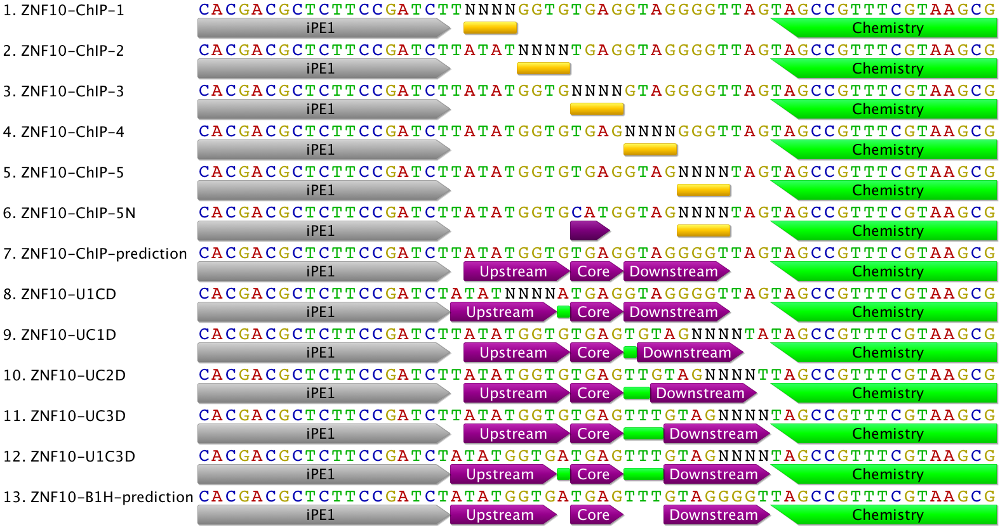

```{r include=FALSE}
library(stringr)
library(dplyr)
library(tidyr)
library(readr)
library(ggplot2)
library(TFCookbook)
library(ggrepel)
library(ggalluvial)
```

```{r include=FALSE}
ChIP.reference    = "ATATGGTG-TGAG---GTAGGGGT"
ChIP5N.reference  = "ATATGGTG-CATG---GTAGGGGT"
U1CD.reference    = "ATATGGTGATGAG---GTAGGGGT"
UC1D.reference    = "ATATGGTG-TGAGT--GTAGGGGT"
UC2D.reference    = "ATATGGTG-TGAGTT-GTAGGGGT"
UC3D.reference    = "ATATGGTG-TGAGTTTGTAGGGGT"
U1C3D.reference   = "ATATGGTGATGAGTTTGTAGGGGT"
B1H.reference     =  U1C3D.reference

library_type <- function(seq) {
  if (stringr::str_detect(seq, "ATATGGTGATGAGTTTGTAGGGGT") == TRUE) return("B1H(reference)")
  else if (stringr::str_detect(seq, "TATATGGTGTGAGGTAGGGGTTAG") == TRUE) return("ChIP(reference)")
  else if (stringr::str_detect(seq, "TATATGGTGTGAGGTAG....TAG")) return("UCD-5")
  else if (stringr::str_detect(seq, "T....GGTGTGAGGTAGGGGTTAG")) return("UCD-1")
  else if (stringr::str_detect(seq, "TATAT....TGAGGTAGGGGTTAG")) return("UCD-2")
  else if (stringr::str_detect(seq, "TATATGGTGCATGGTAG....TAG")) return("UCD-5N")
  else if (stringr::str_detect(seq, "TATATGGTG....GTAGGGGTTAG")) return("UCD-3")
  else if (stringr::str_detect(seq, "TATATGGTGTGAG....GGGTTAG")) return("UCD-4")
  else if (stringr::str_detect(seq, "ATATGGTGATGAGTTTGTAG....")) return("U1C3D")
  else if (stringr::str_detect(seq, "ATAT....ATGAGGTAGGGGTTAG")) return("U1CD")
  else if (stringr::str_detect(seq, "TATATGGTGTGAGTGTAG....TA")) return("UC1D")
  else if (stringr::str_detect(seq, "TATATGGTGTGAGTTGTAG....T")) return("UC2D")
  else if (stringr::str_detect(seq, "TATATGGTGTGAGTTTGTAG....")) return("UC3D")
  else return("Unclassified")
}

realign_sequence <- function(seq, library) {
  if(library %in% c("ChIP(refernce)","UCD-1", "UCD-2", "UCD-3", "UCD-4", "UCD-5", "UCD-5N"))
    return(str_c(substr(seq, 2, 9), "-", substr(seq, 10, 13), "---", substr(seq, 14, 21)))
  else if (library == "U1C3D")
    return(seq)
  else if (library == "U1CD")
    return(str_c(substr(seq, 1, 8), "ATGAG---GTAGGGGT"))
  else if (library == "UC1D")
    return(str_c("ATATGGTG-TGAGT--", substr(seq, 15, 22 )))
  else if (library == "UC2D")
    return(str_c("ATATGGTG-TGAGTT-", substr(seq, 16, 23 )))
  else if (library == "UC3D")
    return(str_c("ATATGGTG-TGAGTTT", substr(seq, 17, 24 )))
  else return("")
}


col_scheme = ggseqlogo::make_col_scheme(chars=c('A', 'C', 'G', 'T'),
                             cols=c('darkgreen', 'blue', 'orange', 'red'))

```

## Background and Experimental design

Human ZNF10 is a KRAB- zinc finger protein (ZFP) consisting of 10 C2H2 fingers. Based on ChIP-seq analysis by Abhi, B1H motif prediciton and the cross-comparison between the two, it is likely that its finger one to finger eight recognize the underlying motif in some irregular configuration with some internal bases missing as shown below.

To verify this irregular recognition model, I made expression construct to express the truncated F1-F8 of human ZNF10, and designed Spec-seq libraries to randomize each position based on predicted ChIP-seq motifs (UCD-1 to UCD-5). We can artificially designate portion of the predicted motif as Upstream (ATATGGTG), Core (TGAG), and Downstream (GTAGGGGT) respectively. Based on my previous work, it is very likely that ZNF10 also has the feature of dependent recognition, i.e., the proper recognition of Upstream or Downstream motif depends on the presense of intact core site (TGAT), so I included additional UCD-5N library to test this hypothesis. Under this Upstream-Core-Downstream notation, the regular B1H-predicted site can be designated as Upstream-1bp spacer-Core-3bp spacer-Downstream (U1C3D), so I included five different libraries to test the relative binding preference of ZNF10 for different spacing formats including both ChIP- and B1H- prediced sites.



## Counting sequences from raw sequencing files

```{r message=FALSE, warning=FALSE, eval=FALSE}
require(readr)
require(dplyr)

Sample1.Bound <- read_csv("ZNF10.sample1.bound.raw",
  col_names = FALSE
) %>%
  count(Sequence=substring(X1, 1, 24), name="Reads")

Sample1.Unbound <- read_csv("ZNF10.sample1.unbound.raw",
  col_names = FALSE
) %>%
  count(Sequence=substring(X1, 1, 24), name="Reads")

Sample2.Bound <- read_csv("ZNF10.sample2.bound.raw",
  col_names = FALSE
) %>%
  count(Sequence=substring(X1, 1, 24), name="Reads")

Sample2.Unbound <- read_csv("ZNF10.sample2.unbound.raw",
  col_names = FALSE
) %>%
  count(Sequence=substring(X1, 1, 24), name="Reads")

```


```{r eval=TRUE, include=FALSE}
#save.image("ZNF10.RData")
load("../data/ZNF10.RData")
```

### Caculating relative binding affinity and energy based on Bound and Unbound reads for each variant.
```{r warning=FALSE}
Sample1.processed <- 
  inner_join(Sample1.Bound, Sample1.Unbound, by = "Sequence") %>%
  mutate(Library = purrr::map_chr(Sequence, library_type)) %>%
  mutate(Sequence = purrr::map2_chr(Sequence, Library, realign_sequence)) %>%
  dplyr::rename(Bound = 'Reads.x', Unbound = 'Reads.y') %>%
  filter(Bound+Unbound >=50, Library != "Unclassified") %>%
  mutate("B/Ub" = Bound / Unbound,
         pBound = Bound/sum(Bound),
         pUnbound = Unbound/sum(Unbound),
         "Relative Energy" = -log(Bound / Unbound),
         Mismatch.ChIP = TFCookbook::countMismatch(Sequence, ChIP.reference),
          Mismatch.B1H =  TFCookbook::countMismatch(Sequence, B1H.reference)
         ) %>%
  arrange(`Relative Energy`)

Sample1.processed

#write.csv(Sample1.processed, file = "ZNF10.replicate1.csv", row.names=FALSE)
```


### Summary of Sequencing reads in Bound and Unbound fractions, respectively
```{r}
Sample1.processed %>%
  group_by(Library) %>%
  summarize("Number of variants in library"=n(),
            "Total Bound reads"=sum(Bound),
            "Total Unbound reads"=sum(Unbound),
            "Bound/Unbound" = sum(Bound)/sum(Unbound))
```

```{r fig.height=1.6, fig.width=8}
PEM.ZNF10.ChIP <-
  inner_join(Sample1.Bound, Sample1.Unbound, by = "Sequence") %>%
  mutate(Library = purrr::map_chr(Sequence, library_type)) %>%
  dplyr::rename(Bound = 'Reads.x', Unbound = 'Reads.y') %>%
  filter(Bound+Unbound >=50, Library != "Unclassified") %>%
  mutate("B/Ub" = Bound / Unbound,
         "Energy" = -log(Bound / Unbound),
         Mismatch.ChIP = TFCookbook::countMismatch(Sequence, "TATATGGTGTGAGGTAGGGGTTAG"),
         ) %>%
  arrange(`Energy`) %>%
  dplyr::filter(Mismatch.ChIP <= 2) %>%
  TFCookbook::buildEnergyModel() %>%
  TFCookbook::as.PEM()

ZNF10.motif = PEM.ZNF10.ChIP[,2:21]

TFCookbook::plotEnergyLogo(PEM.ZNF10.ChIP)

#save(list = "ZNF10.motif", file = "ZNF10.motif.RData")
```

```{r include=FALSE}
Sample2.processed <- 
  inner_join(Sample2.Bound, Sample2.Unbound, by = "Sequence") %>%
  mutate(Library = purrr::map_chr(Sequence, library_type)) %>%
  mutate(Sequence = purrr::map2_chr(Sequence, Library, realign_sequence)) %>%
  dplyr::rename(Bound = 'Reads.x', Unbound = 'Reads.y') %>%
  filter(Bound+Unbound >=50, Library != "Unclassified") %>%
  mutate("B/Ub" = Bound / Unbound,
         pBound = Bound/sum(Bound),
         pUnbound = Unbound/sum(Unbound),
         "Relative Energy" = -log(Bound / Unbound),
         Mismatch.ChIP = TFCookbook::countMismatch(Sequence, ChIP.reference),
          Mismatch.B1H =  TFCookbook::countMismatch(Sequence, B1H.reference)
         ) %>%
  arrange(`Relative Energy`)

Sample2.processed %>%
  group_by(Library) %>%
  summarize("Number of variants in library"=n(),
            "Total Bound reads"=sum(Bound),
            "Total Unbound reads"=sum(Unbound),
            "Bound/Unbound" = sum(Bound)/sum(Unbound))

#write.csv(Sample2.processed, file = "ZNF10.replicate2.csv", row.names=FALSE)
```


## Build motif models based on all double variants of ChIP-reference site

```{r fig.height=2.5, fig.width=8, message=FALSE, warning=FALSE}
plot.sample1.ChIP <- Sample1.processed %>%
  dplyr::filter(Library %in% c("ChIP-1", "ChIP-2", "ChIP-3", "ChIP-4", "ChIP-5")) %>%
  dplyr::filter(Mismatch.ChIP<=2) %>%
  rename(Energy=`Relative Energy`) %>%
  TFCookbook::buildEnergyModel() %>%
  TFCookbook::getEnergyMatrix() %>%
  TFCookbook::plotEnergyLogo() +
  ggtitle("Motif of ZNF10\nSample #1, ChIP-(1-5) variants") +
  annotate('segment', x = .5, xend=8.5, y=-1.5, yend=-1.5, size=2) + 
  annotate('text', x=5, y=-1.4, label='Upstream Motif', color = "blue") + 
  annotate('segment', x = 10, xend=13.2, y=-1.5, yend=-1.5, size=2) + 
  annotate('text', x=11.6, y=-1.4, label='Core Motif', color = "red") + 
  annotate('segment', x = 16.5, xend=24.5, y=-1.5, yend=-1.5, size=2) + 
  annotate('text', x=20, y=-1.4, label='Downstream Motif', color = "brown") + 
  theme(plot.title = element_text(hjust = 0.5))


plot.sample1.ChIP
#ggsave("ZNF10.Sample1.logo.png", plot=last_plot())
```