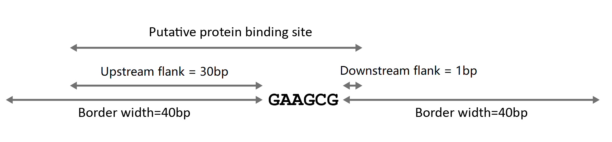
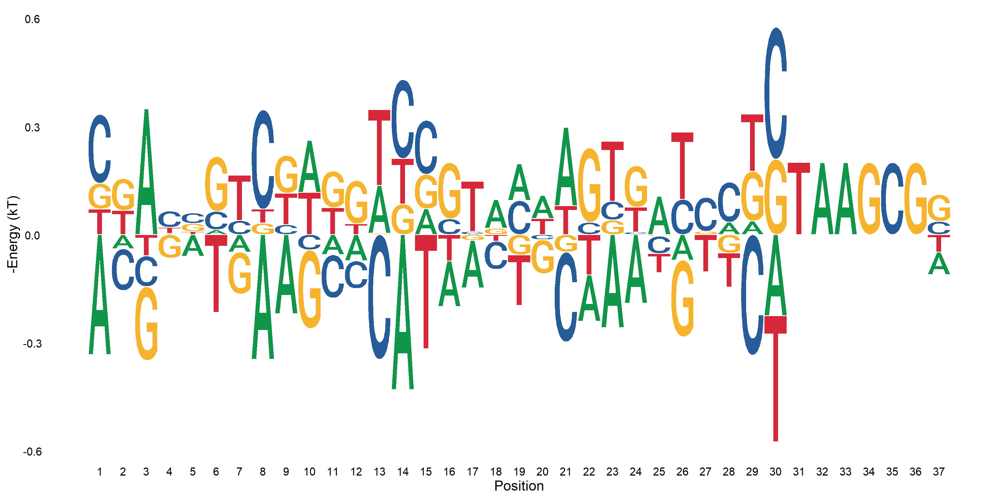

```{r message=FALSE, warning=FALSE, include=FALSE}
library(dplyr)
library(magrittr)
library(ggplot2)
library(GenomicRanges)
library(BSgenome.Hsapiens.UCSC.hg19)
library(motifmatchr)
library(TFCookbook)
```


```{r}
## Parameters for Iterative motif analysis
anchor <- "GAAGCG"
border_width <- 40
upstream_flank <- 30
downstream_flank <- 1
```

```{r Functions used to count exo reads, include=FALSE}
countExo <- function(chrom, start, end, direction, exoReads=ZNF343_exo_reads_by_chrome){
  if(direction=="+"){
    upstream_count <- exoReads[[chrom]] %>%
      filter(strand=="+", between(edge, start-border_width, end)) %>%
      tally(wt=n)
    
    downstream_count <- exoReads[[chrom]] %>%
      filter(strand=="-", between(edge, start, end+border_width)) %>%
      tally(wt=n)
  }
  else if(direction=="-"){
    upstream_count <- exoReads[[chrom]] %>%
      filter(strand=="-", between(edge, start , end+border_width)) %>%
      tally(wt=n)
    
    downstream_count <- exoReads[[chrom]] %>%
      filter(strand=="+", between(edge, start-border_width, end)) %>%
      tally(wt=n)
  }
  
  return((upstream_count+downstream_count)[[1]])
}

countExo2 <- function(chrom, start, end, direction, exoReads=ZNF343_exo_reads_by_chrome){
   if(direction=="+"){
     exoReads[[chrom]] %>%
       dplyr::filter(between(edge, start-border_width, end+border_width)) %>%
       mutate(position=edge-start+border_width+1) -> temp
     
     subset(temp, strand=="+") -> plus
     plus_count[plus$position] <<- plus_count[plus$position] + plus$n
    
     subset(temp, strand=="-") -> minus
     minus_count[minus$position] <<- minus_count[minus$position] + minus$n
   }
  else{
    exoReads[[chrom]] %>%
      dplyr::filter(between(edge, start-border_width, end+border_width)) %>%
      mutate(position=end+border_width-edge+1) -> temp
    
    subset(temp, strand=="-") -> plus
    plus_count[plus$position] <<- plus_count[plus$position] + plus$n
    
    subset(temp, strand=="+") -> minus
    minus_count[minus$position] <<- minus_count[minus$position] + minus$n
  }
}
```


## Importing ChIP-exo raw reads of ZNF343 protein

The raw ChIP-exo reads are stored in ZNF343.bed, and peaks calling positions data are stored in ZNF343_peaks.bed. Both are directly downloaded from https://www.ncbi.nlm.nih.gov/geo/query/acc.cgi?acc=GSM2466539

```{r message=FALSE, warning=FALSE}
# Sorting and counting ChIP-exo reads based on chromosome and its first base position(defined as edge)

ZNF343_exo_reads <- readr::read_table2("../ZNF343.bed", 
                                       col_names =
                                  c("chrome","start","end","name","score","strand")) %>%
  dplyr::mutate(edge=ifelse(strand=="+",start,end)) %>%
  dplyr::count(chrome, strand, edge) %>%
  dplyr::arrange(chrome, strand, edge) %>%
  group_by(chrome)

# Spliting ChIP-exo reads to separate data tables based on chromosome to speed up computation process
ZNF343_exo_reads_by_chrome <- ZNF343_exo_reads %>%
  group_split()

names(ZNF343_exo_reads_by_chrome) <- group_keys(ZNF343_exo_reads)[[1]]
rm(ZNF343_exo_reads)
```

```{r eval=FALSE, include=FALSE}
#save.image("data/ZNF343_exo.RData")
load("data/ZNF343_exo.RData")
```

## Importing ChIP-exo peaks called from MACS calling of ZNF343 data

```{r message=FALSE, warning=FALSE}
ZNF343_peaks <- rtracklayer::import("data/ZNF343_peaks.bed",format="BED")

as.data.frame(ZNF343_peaks)
```


## Searching for all GAAGCG anchor positions within ZNF343 ChIP-exo peaks

```{r warning=FALSE, message=FALSE}
# Creating anchor motif with prefixed bases
Anchor_pfm <- TFBSTools::PFMatrix(ID="Anchor", name=anchor,
                                  profileMatrix=matrix(nrow = 4, ncol = nchar(anchor), byrow = TRUE,
                                                       dimnames = list(c("A", "C", "G", "T"))) %>%
                                    TFCookbook::addAnchorMatrix("GAAGCG", height = -1))
  
# Finding all anchor sites within ZNF343 ChIP-exo peaks
(Anchor_pos <- motifmatchr::matchMotifs(Anchor_pfm, ZNF343_peaks, genome = "hg19",
              out="positions",p.cutoff = 1e-5,)[[1]] %>% as_tibble() %>%
    select(seqnames, start, end, strand))
```


## Counting the ChIP-exo reads adjacent to each anchor site

```{r}
Anchor_pos %<>% mutate(exo_count=mapply(countExo,
                          as.character(seqnames), start, end, strand))
```

### Ploting the acculamative ChIP-exo reads in forward and reverse direction resectively near the anchor sites.
```{r fig.height=6, fig.width=15, warning=FALSE}
plus_count <- array(0L, dim=nchar(anchor)+2*border_width)
minus_count <- array(0L, dim=nchar(anchor)+2*border_width)

Anchor_pos %>% mutate(exo_count=mapply(countExo2,
                          as.character(seqnames), start, end, strand))

ggplot()+
  geom_bar(aes(x=-39:46, weight=plus_count), fill="#5B9Bd5") +
  geom_bar(aes(x=-39:46, weight=-minus_count), fill="#FFC000") +
  xlim(-39,31) + ylim(-550, 450) +
  xlab("Relative position (bp)") +
  ylab("Acculative ChIP-exo Reads") +
  theme_bw() + theme(panel.grid.minor.y = element_blank())
```


```{r fig.height=3.5, fig.width=6}
# Creating anchor motif with prefixed bases
Anchor_pfm.GAAGCC <- TFBSTools::PFMatrix(ID="Anchor", name=anchor,
                                  profileMatrix=matrix(nrow = 4, ncol = nchar(anchor), byrow = TRUE,
                                                       dimnames = list(c("A", "C", "G", "T"))) %>%
                                    TFCookbook::addAnchorMatrix("GAAGCC", height = -1))
  
# Finding all anchor sites within ZNF343 ChIP-exo peaks
(Anchor_pos.GAAGCC <- motifmatchr::matchMotifs(Anchor_pfm.GAAGCC, ZNF343_peaks, genome = "hg19",
              out="positions",p.cutoff = 1e-5,)[[1]] %>% as_tibble() %>%
    select(seqnames, start, end, strand))

plus_count <- array(0L, dim=nchar(anchor)+2*border_width)
minus_count <- array(0L, dim=nchar(anchor)+2*border_width)

Anchor_pos.GAAGCC %>% mutate(exo_count=mapply(countExo2,
                          as.character(seqnames), start, end, strand))

ggplot()+
  geom_bar(aes(x=-39:46, weight=plus_count), fill="#5B9Bd5") +
  xlim(-39,31) + scale_x_continuous(expand = c(0,0), limits = c(-30, 30)) +
  theme_bw() +
  theme(panel.grid.minor.y = element_blank(), panel.grid.minor.x = element_blank(),
        axis.title.x = element_blank(),
        axis.title.y = element_blank()) -> plot.forward

ggplot()+
   geom_bar(aes(x=-39:46, weight=minus_count), fill="#FFC000") +
   xlim(-39,31) + scale_x_continuous(expand = c(0,0), limits = c(-30, 30)) +
   scale_y_continuous(trans = "reverse") +
   theme_bw() +
   theme(panel.grid.minor.y = element_blank(), panel.grid.minor.x = element_blank(),
        axis.title.x = element_blank(),
        axis.title.y = element_blank(),
        axis.text.x  = element_blank()) -> plot.reverse

(cowplot::plot_grid(plot.forward,
                   plot.reverse,
                   ncol = 1) -> plot.ExoReads.GAAGCC)
```


```{r fig.height=3.5, fig.width=6}
# Creating anchor motif with prefixed bases
Anchor_pfm.GAAGCG <- TFBSTools::PFMatrix(ID="Anchor", name=anchor,
                                  profileMatrix=matrix(nrow = 4, ncol = nchar(anchor), byrow = TRUE,
                                                       dimnames = list(c("A", "C", "G", "T"))) %>%
                                    TFCookbook::addAnchorMatrix("GAAGCG", height = -1))
  
# Finding all anchor sites within ZNF343 ChIP-exo peaks
(Anchor_pos.GAAGCG <- motifmatchr::matchMotifs(Anchor_pfm.GAAGCG, ZNF343_peaks, genome = "hg19",
              out="positions",p.cutoff = 1e-5,)[[1]] %>% as_tibble() %>%
    select(seqnames, start, end, strand))

plus_count <- array(0L, dim=nchar(anchor)+2*border_width)
minus_count <- array(0L, dim=nchar(anchor)+2*border_width)

Anchor_pos.GAAGCG %>% mutate(exo_count=mapply(countExo2,
                          as.character(seqnames), start, end, strand))

ggplot()+
  geom_bar(aes(x=-39:46, weight=plus_count), fill="#5B9Bd5") +
  xlim(-39,31) + scale_x_continuous(expand = c(0,0), limits = c(-30, 30)) +
  theme_bw() +
  theme(panel.grid.minor.y = element_blank(), panel.grid.minor.x = element_blank(),
        axis.title.x = element_blank(),
        axis.title.y = element_blank()) -> plot.forward

ggplot()+
   geom_bar(aes(x=-39:46, weight=minus_count), fill="#FFC000") +
   xlim(-39,31) + scale_x_continuous(expand = c(0,0), limits = c(-30, 30)) +
   scale_y_continuous(trans = "reverse") +
   theme_bw() +
   theme(panel.grid.minor.y = element_blank(), panel.grid.minor.x = element_blank(),
        axis.title.x = element_blank(),
        axis.title.y = element_blank(),
        axis.text.x  = element_blank()) -> plot.reverse

(cowplot::plot_grid(plot.forward,
                   plot.reverse,
                   ncol = 1) -> plot.ExoReads.GAAGCG)
```


```{r fig.height=3.5, fig.width=6}
# Creating anchor motif with prefixed bases
Anchor_pfm.GCAGCG <- TFBSTools::PFMatrix(ID="Anchor", name=anchor,
                                  profileMatrix=matrix(nrow = 4, ncol = nchar(anchor), byrow = TRUE,
                                                       dimnames = list(c("A", "C", "G", "T"))) %>%
                                    TFCookbook::addAnchorMatrix("GCAGCG", height = -1))
  
# Finding all anchor sites within ZNF343 ChIP-exo peaks
(Anchor_pos.GCAGCG <- motifmatchr::matchMotifs(Anchor_pfm.GCAGCG, ZNF343_peaks, genome = "hg19",
              out="positions",p.cutoff = 1e-5,)[[1]] %>% as_tibble() %>%
    select(seqnames, start, end, strand))

plus_count <- array(0L, dim=nchar(anchor)+2*border_width)
minus_count <- array(0L, dim=nchar(anchor)+2*border_width)

Anchor_pos.GCAGCG %>% mutate(exo_count=mapply(countExo2,
                          as.character(seqnames), start, end, strand))

ggplot()+
  geom_bar(aes(x=-39:46, weight=plus_count), fill="#5B9Bd5") +
  xlim(-39,31) + scale_x_continuous(expand = c(0,0), limits = c(-30, 30)) +
  theme_bw() +
  theme(panel.grid.minor.y = element_blank(), panel.grid.minor.x = element_blank(),
        axis.title.x = element_blank(),
        axis.title.y = element_blank()) -> plot.forward

ggplot()+
   geom_bar(aes(x=-39:46, weight=minus_count), fill="#FFC000") +
   xlim(-39,31) + scale_x_continuous(expand = c(0,0), limits = c(-30, 30)) +
   scale_y_continuous(trans = "reverse") +
   theme_bw() +
   theme(panel.grid.minor.y = element_blank(), panel.grid.minor.x = element_blank(),
        axis.title.x = element_blank(),
        axis.title.y = element_blank(),
        axis.text.x  = element_blank()) -> plot.reverse

(cowplot::plot_grid(plot.forward,
                   plot.reverse,
                   ncol = 1) -> plot.ExoReads.GCAGCG)
```


```{r fig.height=8, fig.width=6}
cowplot::plot_grid(plot.ExoReads.GAAGCG,
                   plot.ExoReads.GCAGCG,
                   ncol = 1)

ggsave("ZNF343 Exoreads distribution.eps", plot = last_plot(), height = 8, width = 6)
```


## Building binding energy model based on ChIP-exo reads data near anchor sites

For each individual anchor site, the full flanking sequence is extracted based on upstream_flank and downstream_flank parameters (For ZNF343, it's 30 and 1 respectively). 

By taking negative logarithmic ratio of the exo reads, we can estimate the relative binding energy for each site.

${{P}_{i}}=\frac{1}{{{e}^{{({{E}_{i}}-\mu )}/{k_{B}T}}}+1}\approx {{e}^{-{({{E}_{i}}-\mu )}/{k_{B}T}}}$

where $P_{i}$ is the occupancy, or binding probability of TF to some particular site i in the genome, which should be porpotional to the exo reads near site i. In an ideal equilibrium-driven system, the occupancy can be defined by above equation, and approximated as ${e}^{-{({{E}_{i}}-\mu )}/{k_{B}T}}$ if the protein concentration is sufficiently low. Therefore we can use the negative logarithmic ratio of exo reads near each site to calculate relative binding energy for data regression and motif analysis
    
```{r}
# Extending the anchor position by fixed upstream and downstream distances
Anchor_pos %<>%
  filter(exo_count>0) %>%
  mutate(start = if_else(strand=="+",
                         start-upstream_flank, start-downstream_flank),
         end = if_else(strand=="+",
                         end+downstream_flank, end+upstream_flank),
         Energy=-log(exo_count))

# Extracting sequences surrounding the anchor sites
Anchor_pos$Sequence <- BSgenome::getSeq(Hsapiens,
                                        names=Anchor_pos$seqnames,
                                        start=Anchor_pos$start,
                                        end=Anchor_pos$end,
                                        strand=Anchor_pos$strand) %>% as.character()

Anchor_pos
```

TFCookbook is set of functions written in R to analyze and visualize protien-DNA energy model, which can be accessed from https://github.com/zeropin/TFCookbook.
```{r}
model <- TFCookbook::buildEnergyModel(Anchor_pos)

summary(model)
```


### Plotting binding energy logo based on Position Energy Matrix (PEM)
```{r fig.height=6, fig.width=12}
matrix <- TFCookbook::getEnergyMatrix(model)

# Anchor positions are added into energy matrix for visualization purposes
matrix[,31:36] <- -0.2*anchorMatrix("GAAGCG")

TFCookbook::plotEnergyLogo(matrix)
```

### Negative control with alternative anchor site(s)

We can perform the same analysis with any alternative anchor site, e.g., tAAGCG, and the resulting motif in the extended region don't match published HT-SELEX and B1H prediction, which lends evidence to our dependent recogition model of ZFPs from another perspective.

```{r eval=FALSE, include=FALSE}
ggplot2::ggsave("images/Logo_tAAGCG.png", width=12, height=6)
```

